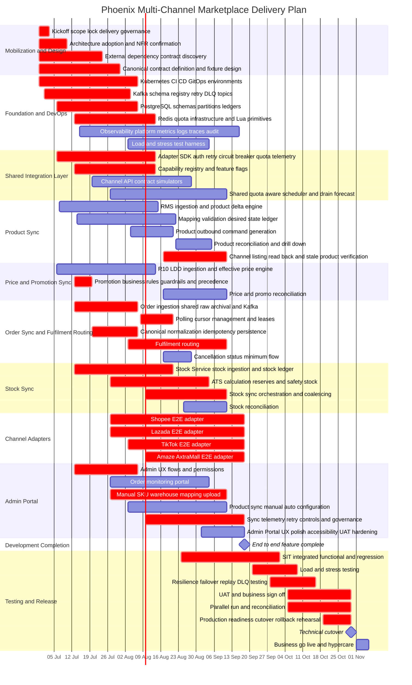

# Plan Nov 1 PMC

Status: Draft delivery and staffing plan; architecture approved  
Kickoff: Monday, 2026-06-29  
Development complete target: Friday, 2026-09-18  
Progressive SIT starts: Monday, 2026-08-24  
Formal UAT, performance, cutover window: 2026-09-21 to 2026-10-30  
Business go-live: Sunday, 2026-11-01  

## 1. Executive Summary

This plan sizes the team and work breakdown required to deliver the November 1 Phoenix Multi-Channel Marketplace release for:

- Product Sync.
- Price and Promotion Sync.
- Order Sync and Fulfilment Routing.
- Stock Sync.
- Admin Portal for operators/users to monitor orders, upload SKU and warehouse mapping for WMS routing, configure product master sync manual/auto behavior, monitor sync telemetry, and trigger controlled manual retry.
- Production support for Shopee, Lazada, TikTok, and Amaze/AxtraMall according to the current Gantt scope.
- Testing phase including SIT, UAT, load testing, stress testing, resilience testing, cutover rehearsal, and release readiness.

The plan assumes the architecture in the Markdown and diagrams.net source has been presented and approved. Therefore, this plan does not reserve time for major architecture redesign. It reserves time only for implementation-level architecture adoption, ADRs, NFR confirmation, sizing validation, and contract alignment.

The plan assumes the Shopee, Lazada, TikTok, and Amaze/AxtraMall marketplace API specifications needed by the current Gantt scope are provided or accessible. It does not assume that enterprise contracts are finalized. Dependencies on RMS, R10/LDD, Stock Service, WMS/MFC, DHL, Auto POS, business mapping rules, credentials, and production-like test access are highlighted separately.

The delivery goal is aggressive because the requested scope is deeper than the previously bounded November MVP. The earlier MVP excluded production stock sync, full fulfilment depth, and a richer operator portal. The current Gantt reduces several task efforts to reflect the latest project scope and starts progressive SIT earlier, while also carrying an Amaze/AxtraMall adapter stream. The plan remains feasible only with parallel workstreams and enough QA capacity to test while development is still in progress.

## 2. Recommended Headcount

| Role | Recommended count | Purpose |
|---|---:|---|
| Developers | 12 | Build platform foundation, domain services, adapters, shared Admin Portal/BFF capability, DevOps automation, observability, and production hardening in parallel |
| Tech Lead / Solution Architect | 1 dedicated | Own system design, canonical contracts, sequencing, technical decisions, reviews, NFRs, and architecture risk |
| QA Engineers | 6 | Own functional QA, API automation, integration testing, Admin Portal/UAT validation, regression, load/stress testing, and release evidence |

The 12 developers should include one dedicated DevOps/platform engineer, shared platform/foundation engineers, domain owners for product, price, order, fulfilment, and stock, two channel adapter engineers, and shared Admin Portal/BFF ownership distributed across domain engineers. The latest Gantt scope no longer reserves separate Admin Portal developer codes.

This is a tighter staffing model than the previous larger plan. It is viable only because several task efforts have been reduced, per-channel certification buffers have been removed from the Gantt, and Admin Portal work is treated as shared operational screens/APIs rather than a separately staffed product stream.

Architecture approval does not materially reduce the recommended headcount. It removes the need for major architecture decision cycles, but the saved effort should be preserved as delivery contingency because the remaining risks are integration, stock correctness, fulfilment routing, performance evidence, certification, and UAT readiness.

## 3. Capacity Rationale

There are 60 weekdays from 2026-06-29 to 2026-09-18 for development. A developer does not produce 60 mandays of feature output in this period because capacity is consumed by design reviews, ceremonies, environment setup, dependency clarification, code review, rework, integration support, testing support, production-readiness work, and onboarding/context switching.

Planning assumptions:

| Capacity factor | Value |
|---|---:|
| Development calendar window | 60 weekdays |
| Effective developer productivity | 67-72% |
| Effective dev mandays per developer | 40-43 MD |
| 12-developer effective capacity | 480-516 MD |
| Testing and hardening calendar window | 30 weekdays |
| QA effective productivity during full test phase | 70-75% |

The task breakdowns in the latest Gantt total about 306 MD across build, QA, and release tasks. That direct effort fits inside the 12-developer build model plus dedicated QA capacity, but the calendar remains long because many items are elapsed integration windows rather than full-time effort. Shared components such as the adapter SDK, observability, platform, and Admin Portal stay open while downstream teams consume them and defects are found.

## 4. Workstream Staffing

| Workstream | Developers | QA | Why this staffing is needed |
|---|---:|---:|---|
| Platform, DevOps, CI/CD, environments, observability | 2 | Shared 1 | Kafka, PostgreSQL, Redis, object storage, Kubernetes, GitOps, dashboards, alerting, and deployment controls are prerequisites for all feature work |
| Canonical contracts, schema registry, shared adapter SDK | 2 | Shared 1 | Product, price, stock, order, and three adapters all depend on stable contracts and shared mechanics |
| Product Sync | 1 | 1 | RMS ingestion, product delta, mapping, desired-state ledger, outbound command generation, and reconciliation can run as an independent domain stream |
| Price and Promotion Sync | 1 | 1 | R10/LDD ingestion, effective-date rules, Auto/Manual logic, clubpack, guardrails, and reconciliation need specialized domain focus |
| Order Sync and Fulfilment Routing | 2 | 1 | Order normalization, idempotency, persistence, routing, cancellation handling, and fulfilment hand-off are correctness-sensitive and on the critical path |
| Stock Sync | 2 | 1 | Stock Service ingestion, stock ledger, ATS calculation, safety-stock baseline, coalescing, outbound stock sync, and reconciliation are high-risk correctness work |
| Shopee, Lazada, TikTok, Amaze/AxtraMall adapters | 2 | Shared 1.5 | Four channel cells remain in the current Gantt; Shopee/Lazada share DEV-11 and TikTok/Amaze/AxtraMall share DEV-12 with SDK/domain support |
| Admin Portal and operations APIs | Shared | 1 | Operators still need monitoring, mapping upload, configuration, telemetry, retry, audit, and UAT-ready UX, but implementation is shared across DEV-04, DEV-05, DEV-08, and domain owners |
| Performance, resilience, release hardening | Shared | 1 dedicated | Load/stress testing, failover, replay, DLQ, and cutover proof require dedicated QA/SDET ownership |

## 5. Delivery Gantt

## 6. Task Duration Justification

### 6.0 Owner Assignment and Staffing Ramp

#### 6.0.1 Role Codes

The plan uses role codes rather than personal names so the staffing model can be mapped to actual team members later. The latest plan is capped at 12 developers, so all delivery ownership must fit within DEV-01 through DEV-12.

| Code | Role |
|---|---|
| TL | Dedicated Tech Lead / Solution Architect |
| DEV-01 | DevOps/platform engineer |
| DEV-02 | Backend/platform foundation engineer |
| DEV-03 | Shared contracts and schema engineer |
| DEV-04 | Shared adapter SDK engineer |
| DEV-05 | Product Sync engineer |
| DEV-06 | Price and Promotion Sync engineer |
| DEV-07 | Order Sync engineer |
| DEV-08 | Fulfilment routing engineer |
| DEV-09 | Stock Sync / ATS engineer |
| DEV-10 | Stock orchestration engineer |
| DEV-11 | Shopee/Lazada adapter engineer |
| DEV-12 | TikTok/channel adapter engineer |
| QA-01 | QA Lead / test strategy / release evidence |
| QA-02 | API and contract automation QA |
| QA-03 | Domain functional QA |
| QA-04 | Integration and UAT QA |
| QA-05 | Performance, load, stress, and resilience SDET |
| QA-06 | Admin Portal, usability, and operator workflow QA |

#### 6.0.2 Do We Need Everyone From Day 1?

No. The plan does not require all 12 developers and 6 QA engineers on day 1. It does require the full developer team by 2026-07-20 because product, price, order, fulfilment, stock, shared integration, channel adapters, and Admin Portal workflows must run in parallel to meet the 2026-09-18 development-complete target.

After 2026-09-18, the staffing shape changes. The project needs fewer feature developers and more testing, defect triage, release, and production-readiness focus. Some developers can roll off after SIT stabilizes, but the Tech Lead, DevOps/platform coverage, adapter coverage, stock/order coverage, Admin Portal support, and QA must remain available until cutover.

#### 6.0.3 Staffing Ramp by Date

| Date range | Developers needed | QA needed | TL needed | Main reason |
|---|---:|---:|---:|---|
| 2026-06-29 to 2026-07-03 | 7 | 1 | 1 | Kickoff, scope lock, approved architecture adoption, DevOps bootstrap, contract discovery, test strategy |
| 2026-07-06 to 2026-07-10 | 9 | 2 | 1 | Canonical contracts, Kafka/schema setup, PostgreSQL design, adapter SDK skeleton, QA fixture strategy |
| 2026-07-13 to 2026-07-17 | 11 | 4 | 1 | Product, price, Redis/ATS, Admin Portal UX/API design, capability registry, and enterprise contract validation start in parallel |
| 2026-07-20 to 2026-08-02 | 12 | 5 | 1 | Full parallel build starts: product, price, order, stock, Shopee, Lazada, Admin Portal, adapter SDK, platform |
| 2026-08-03 to 2026-08-23 | 12 | 6 | 1 | Peak delivery: TikTok, Amaze/AxtraMall, load harness, Admin Portal, all domains, and adapters proceed in parallel |
| 2026-08-24 to 2026-09-18 | 12 | 6 | 1 | Peak delivery continues while progressive SIT starts; QA begins integrated defect discovery before feature complete |
| 2026-09-21 to 2026-10-04 | 9 | 6 | 1 | SIT, Admin Portal regression, load/stress, resilience testing, critical defect fixing; some feature developers can roll off |
| 2026-10-05 to 2026-10-16 | 8 | 6 | 1 | UAT, operator workflow validation, parallel run, reconciliation, priority defect turnaround |
| 2026-10-19 to 2026-10-30 | 6 | 4 | 1 | Cutover, rollback rehearsal, Admin Portal permission/retry checks, production readiness, on-call handover, final release fixes |
| 2026-11-01 to 2026-11-06 | 5 | 4 | 1 | Hypercare, daily reconciliation, incident response, production monitoring, operator support |

Minimum staffing by milestone:

| Milestone date | Minimum team that must be active by this date |
|---|---|
| 2026-06-29 | TL, DEV-01, DEV-02, DEV-03, DEV-04, DEV-07, DEV-09, QA-01 |
| 2026-07-06 | Add DEV-05, DEV-06, QA-02 |
| 2026-07-13 | Add DEV-08, DEV-10, QA-03, QA-06 |
| 2026-07-20 | Add DEV-11, DEV-12, QA-04 |
| 2026-08-03 | Add QA-05 |
| 2026-09-21 | Keep DEV-01, DEV-03, DEV-04, DEV-05, DEV-07, DEV-08, DEV-09, DEV-11, DEV-12, all QA, TL |
| 2026-10-19 | Keep DEV-01, DEV-04, DEV-07, DEV-09, DEV-11, DEV-12, QA-01, QA-04, QA-05, QA-06, TL |

#### 6.0.4 Task Owner Matrix

| Task | Dates | Primary owner | Supporting owners | QA owner | Notes |
|---|---|---|---|---|---|
| Kickoff, scope lock, delivery governance | 2026-06-29 to 2026-07-03 | TL | QA-01, Product Owner, Release Manager | QA-01 | Confirms scope, exclusions, gates, cadence, and escalation path |
| Architecture adoption and NFR confirmation | 2026-06-29 to 2026-07-10 | TL | DEV-01, DEV-02, DEV-03, QA-05 | QA-01 | Converts approved architecture into ADRs, NFR test targets, and implementation rules |
| External dependency contract discovery | 2026-06-29 to 2026-07-24 | TL | DEV-05, DEV-06, DEV-08, DEV-09 | QA-02 | RMS, R10/LDD, Stock Service, WMS/MFC, DHL, Auto POS contracts and samples |
| Canonical contract definition and fixture design | 2026-06-29 to 2026-07-31 | DEV-03 | TL, DEV-05, DEV-06, DEV-07, DEV-09 | QA-02 | Product, price, stock, order, fulfilment, and adapter result contracts |
| Kubernetes CI CD GitOps environments | 2026-06-29 to 2026-08-07 | DEV-01 | DEV-02 | QA-05 | Environments, deployment path, rollback, resource controls |
| Kafka schema registry retry DLQ topics | 2026-07-01 to 2026-08-04 | DEV-02 | DEV-03, DEV-01 | QA-02 | Topics, schema registry, retry, DLQ, partition rules |
| PostgreSQL schemas, partitions, ledgers | 2026-07-06 to 2026-08-07 | DEV-02 | DEV-03, DEV-07, DEV-09 | QA-02 | Domain schemas, ledgers, idempotency tables, indexes |
| Redis quota infrastructure and Lua primitives | 2026-07-13 to 2026-08-14 | DEV-09 | DEV-01, DEV-10 | QA-05 | Distributed quotas, token-bucket Lua primitives; ATS logic belongs to i2 |
| Observability platform (metrics, logs, traces, audit pipeline) | 2026-07-15 to 2026-09-16 | DEV-01 | DEV-02, DEV-04, all domain owners | QA-01 | Consumed by a5 (Admin Portal); Admin does not build separate telemetry |
| Load and stress test harness | 2026-08-03 to 2026-09-04 | QA-05 | DEV-01, DEV-02, DEV-04 | QA-05 | Synthetic load, channel simulators, failure injection |
| Adapter SDK: auth, retry, circuit breaker, quota, telemetry | 2026-07-06 to 2026-08-14 | DEV-04 | DEV-11, DEV-12, DEV-01 | QA-02 | Shared mechanics for all channel adapters |
| Capability registry and feature flags | 2026-07-13 to 2026-08-14 | DEV-04 | DEV-03, DEV-01 | QA-02 | Endpoint capability, quota, batch, kill switch, writer ownership |
| Channel API contract simulators | 2026-07-20 to 2026-08-28 | QA-02 | DEV-03, DEV-04, DEV-11, DEV-12 | QA-02 | Fake API endpoints; test data payloads belong to m4 |
| Shared quota-aware scheduler and drain forecast | 2026-07-27 to 2026-09-11 | DEV-06 | DEV-04, DEV-09, DEV-10, DEV-01 | QA-05 | General-purpose scheduler (moved from Price section); all domains depend on it |
| RMS ingestion and product delta engine | 2026-07-07 to 2026-08-15 | DEV-05 | DEV-03, DEV-02 | QA-03 | Source ingestion, versioning, replay, delta decision |
| Mapping, validation, desired-state ledger | 2026-07-14 to 2026-08-22 | DEV-05 | DEV-03, DEV-11 | QA-03 | SKU/listing mapping, validation, desired-state records |
| Product outbound command generation | 2026-08-04 to 2026-08-21 | DEV-05 | DEV-04, DEV-11, DEV-12 | QA-03 | Transform desired-state to commands; coalesce obsolete pending |
| Product reconciliation and drill-down | 2026-08-22 to 2026-09-05 | DEV-05 | DEV-11, DEV-12 | QA-03 | Desired-vs-sent-vs-acknowledged; read-back; operator drill-down |
| Channel listing read-back and stale-product verification | 2026-08-17 to 2026-09-11 | DEV-05 | DEV-11, DEV-12, DEV-03 | QA-03 | Ingest channel listings, cross-reference against RMS master, flag stale/drifted products, feed verified state to Admin Portal for auto/manual field config |
| R10 LDD ingestion and effective price engine | 2026-07-06 to 2026-08-14 | DEV-06 | DEV-03, DEV-02 | QA-03 | Effective-dated price and promotion calculation |
| Promotion business rules, guardrails, and precedence | 2026-07-13 to 2026-07-20 | DEV-06 | TL, Product Owner | QA-03 | Business-rule fixtures; overrides, clubpack, guardrails |
| Price and promo reconciliation | 2026-08-17 to 2026-09-11 | DEV-06 | DEV-05, DEV-04 | QA-03 | Desired/sent/acknowledged state and operations evidence |
| Order ingestion: shared raw archival and Kafka | 2026-07-13 to 2026-08-07 | DEV-07 | DEV-04 | QA-04 | Shared inbound infra: raw archival, Kafka quorum, worker pool isolation |
| Polling cursor management and leases | 2026-08-08 to 2026-08-21 | DEV-07 | DEV-11, DEV-12 | QA-04 | Reusable polling framework: distributed leases, overlap-safe cursors |
| Canonical normalization, idempotency, persistence | 2026-07-20 to 2026-08-07 | DEV-07 | DEV-03, DEV-02 | QA-04 | Canonical order model, duplicate suppression, partition-aware writes |
| Fulfilment routing | 2026-08-03 to 2026-09-11 | DEV-08 | DEV-07, TL | QA-04 | Idempotent hand-off, routing, retry, rejection handling |
| Cancellation status minimum flow | 2026-08-17 to 2026-08-28 | DEV-08 | DEV-07, DEV-11, DEV-12 | QA-04 | Minimum cancellation/status behavior for go-live |
| Stock Service stock ingestion and stock ledger | 2026-07-13 to 2026-08-21 | DEV-09 | DEV-03, DEV-02 | QA-03 | Ordered stock movements, snapshot support, durable ledger |
| ATS calculation, reserves, and safety-stock | 2026-07-27 to 2026-09-04 | DEV-09 | DEV-10, TL | QA-05 | Atomic stock calculation, reserves, idempotency, replay, recovery |
| Stock sync orchestration and coalescing | 2026-08-10 to 2026-09-11 | DEV-10 | DEV-09, DEV-04 | QA-03 | Convert ATS changes into coalesced channel stock commands |
| Stock reconciliation | 2026-08-25 to 2026-09-11 | DEV-10 | DEV-09, DEV-11, DEV-12 | QA-03 | Desired-vs-channel drift and repair path |
| Shopee E2E adapter | 2026-07-27 to 2026-09-18 | DEV-11 | DEV-04, DEV-07, DEV-10 | QA-04 | Inbound order plus product, price, promo, stock outbound |
| Lazada E2E adapter | 2026-07-27 to 2026-09-18 | DEV-11 | DEV-04, DEV-07, DEV-10 | QA-04 | Shares owner with Shopee but must retain separate channel fixtures |
| TikTok E2E adapter | 2026-08-03 to 2026-09-18 | DEV-12 | DEV-04, DEV-07, DEV-10 | QA-04 | Starts after SDK skeleton stabilizes |
| Amaze/AxtraMall E2E adapter | 2026-08-10 to 2026-09-18 | DEV-12 | DEV-04, DEV-07 | QA-04 | Reassigned from DEV-07 to DEV-12 to avoid double-booking |
| Admin UX flows and permissions | 2026-07-13 to 2026-08-07 | DEV-04 | TL, DEV-05, DEV-08, QA-06 | QA-06 | Shared Admin Portal/BFF design; operator roles, navigation, permission model, audit expectations |
| Order monitoring portal | 2026-07-27 to 2026-09-04 | DEV-07 | DEV-04, DEV-08 | QA-06 | Order-domain screen/API support for lifecycle, fulfilment hand-off, exceptions, and evidence |
| Manual SKU warehouse mapping upload | 2026-07-27 to 2026-09-11 | DEV-08 | DEV-04, DEV-09 | QA-06 | Fulfilment-owned mapping upload, validation, preview, approval, audit, versioning, and WMS routing lookup |
| Product sync manual auto configuration | 2026-08-03 to 2026-09-11 | DEV-05 | DEV-04 | QA-06 | Product-domain configuration UI/API, effective date, audit, and rollback |
| Sync telemetry, retry controls, and governance | 2026-08-10 to 2026-09-18 | DEV-04 | DEV-05, DEV-06, DEV-10, DEV-01 | QA-06 | Consumes f5 observability pipeline; retry preview, permission checks, immutable audit |
| Admin Portal UX polish, accessibility, and UAT hardening | 2026-09-01 to 2026-09-18 | DEV-04 | DEV-05, DEV-08, QA-06 | QA-06 | Operator workflow polish, empty/error/loading states, accessibility, UAT evidence |
| SIT integrated functional and regression | 2026-08-24 to 2026-10-02 | QA-01 | DEV-03, DEV-04, DEV-07, DEV-09, DEV-11, DEV-12 | QA-01 | QA owns progressive SIT execution; selected devs stay for defect turnaround |
| Load and stress testing | 2026-09-21 to 2026-10-09 | QA-05 | DEV-01, DEV-02, DEV-04 | QA-05 | 250 orders/sec, 500 orders/sec, stock and price bursts |
| Resilience failover replay DLQ testing | 2026-09-28 to 2026-10-16 | QA-05 | DEV-01, DEV-02, DEV-07, DEV-09 | QA-05 | Failure, replay, duplicate suppression, no-loss testing |
| UAT and business sign-off | 2026-10-05 to 2026-10-30 | QA-04 | TL, DEV-04, DEV-05, DEV-06, DEV-07, DEV-09, DEV-11 | QA-04, QA-06 | Business validation, operator workflow validation, and evidence capture |
| Parallel run and reconciliation | 2026-10-05 to 2026-10-30 | QA-03 | DEV-05, DEV-06, DEV-09, DEV-10 | QA-03 | Compares Phoenix outputs with legacy/shadow results |
| Production readiness, cutover, and rollback rehearsal | 2026-10-19 to 2026-10-30 | DEV-01 | TL, DEV-04, QA-01, QA-05, QA-06, Release Manager | QA-01 | Secrets, PII, access control, kill switches, writer transfer, runbooks, on-call |
| Technical cutover | 2026-10-30 | TL | DEV-01, DEV-04, DEV-07, DEV-09, DEV-11, DEV-12 | QA-01 | Production ownership transfer after rehearsal pass |
| Business go-live and hypercare | 2026-11-01 to 2026-11-06 | TL | DEV-01, DEV-04, DEV-07, DEV-09, DEV-11, DEV-12 | QA-01, QA-04, QA-05, QA-06 | Daily reconciliation, incident response, production monitoring, operator support |

#### 6.0.5 Staffing Justification by Delivery Stage

| Stage | Why the team size is justified |
|---|---|
| 2026-06-29 to 2026-07-03 | Full headcount is not useful yet because the team is still locking scope, turning approved architecture into implementation rules, and confirming dependency owners. Seven developers are enough to start foundation, contracts, order, stock, and adapter SDK work without idle time. |
| 2026-07-06 to 2026-07-17 | The team ramps because contracts, platform setup, product, price, and Redis/ATS work begin. QA also ramps because contract tests and fixture strategy must start before feature completion. |
| 2026-07-20 to 2026-08-23 | Full 12-developer headcount is required. This is the only window where product, price, order, fulfilment, stock, Admin Portal, Shopee, Lazada, TikTok, Amaze/AxtraMall, observability, and test automation can all progress in parallel before progressive SIT starts. |
| 2026-08-24 to 2026-09-18 | Full headcount remains required because progressive SIT begins while development is still finishing. This overlap is intentional: it pulls defect discovery forward without stopping feature completion. |
| 2026-09-21 to 2026-10-16 | Not all 12 developers are needed. The priority shifts to formal load/stress, resilience testing, UAT preparation, Admin Portal regression, and fast defect fixing. Keep the owners for platform, contracts, order, fulfilment, stock, adapters, and Admin Portal; other feature developers can roll off if defect volume is under control. |
| 2026-10-19 to 2026-10-30 | Only the release-critical group is required: DevOps/platform, order, stock, channel adapters, Admin Portal frontend/support, Tech Lead, QA lead, UAT QA, Admin Portal QA, and performance/resilience QA. |
| 2026-11-01 to 2026-11-06 | Hypercare needs production support coverage, not the full build team. Keep enough people to triage production issues, fix urgent defects, and reconcile daily results. |

### 6.1 Mobilization and Design

| Task | Current planned duration | Why it takes this long | Main dependencies |
|---|---|---|---|
| Kickoff, scope lock, delivery governance | 5 business days | TL/PM activity. Confirm scope, excluded features, decision owners, escalation path, sprint cadence, release gates, fallback rules. Cannot be skipped because stock sync and fulfilment routing materially increase scope risk. | Sponsor, Product Owner, Tech Lead, QA Lead, enterprise owners |
| Architecture adoption and NFR confirmation | 2026-06-29 to 2026-07-10 | TL activity. Translate approved architecture into implementation ADRs, service boundaries, topic/schema conventions, sizing assumptions, NFR test targets, operational responsibilities, and workstream-ready acceptance criteria. | Approved architecture docs, draw.io source, Tech Lead, DevOps, senior devs |
| External dependency contract discovery | 2026-06-29 to 2026-07-24 | Enterprise contracts require confirming owners, quotas, payload samples, replay behavior, maintenance windows, error codes, and test endpoints. On the critical path for RMS, R10/LDD, Stock Service, and WMS/MFC. | RMS, R10/LDD, Stock Service, WMS/MFC, DHL, Auto POS owners |
| Canonical contract definition and fixture design | 2026-06-29 to 2026-07-31 | Stabilize product, price, stock, order, fulfilment, and adapter result contracts. Must complete before parallel build teams diverge. | Tech Lead, domain devs, QA automation |

Breakdown:
- Define canonical domain schemas and Avro/Protobuf compatibility rules across all domains (4 md)
- Design error taxonomy, reason codes, and idempotency key strategy (3 md)
- Create canonical test fixtures: success, boundary, error, replay scenarios per domain (3 md)
- **Total: 10 md**

### 6.2 Foundation and DevOps

| Task | Current planned duration | Why it takes this long | Main dependencies |
|---|---|---|---|
| Kubernetes, CI/CD, GitOps, environments | 2026-06-29 to 2026-08-07 | Service templates, namespace/env setup, secrets management, container build, deployment manifests, progressive delivery, rollback, resource limits, topology spread, environment promotion. Supports many parallel services, not one app. | Platform team, security, infrastructure approval |
| Kafka, schema registry, retry/DLQ topics | 2026-07-01 to 2026-08-04 | Broker/topic configuration, schema registry, naming, partition strategy, retry/DLQ, producer/consumer conventions, dashboards. Correct partitioning critical for orders and stock. | Platform foundation, canonical contracts |
| PostgreSQL schemas, partitions, ledgers | 2026-07-06 to 2026-08-07 | Domain schemas, order partition alignment, stock/sync ledgers, idempotency/audit tables, indexes, migrations, archive/retention, connection budgets, read/query constraints for ops screens. | Data model design, canonical contracts |
| Redis quota infrastructure and Lua primitives | 2026-07-13 to 2026-08-14 | Redis for distributed rate limiting. Produces token-bucket infrastructure and reusable Lua building blocks. ATS calculation logic belongs to i2, not this task. | Stock architecture, platform environment |
| Observability platform (metrics, logs, traces, audit pipeline) | 2026-07-15 to 2026-09-16 | Logs, metrics, traces, queue age, platform wait, source delay, retry/DLQ, order acceptance, stock freshness, price/promo drain time, audit trail, channel health. **Boundary:** produces the data pipeline consumed by a5 (Admin telemetry views). Admin Portal does NOT build its own telemetry — it consumes this. | All domain services and adapters |
| Load/stress test harness | 2026-08-03 to 2026-09-04 | Synthetic order/price/stock generators, channel API simulators, quota simulation, failure injection, 250/500 ops/sec scenarios. | Contracts, adapters, platform environments |

Breakdowns:

**f1 — Kubernetes, CI/CD, GitOps, environments**
- Service templates, namespace/env setup, secrets management (3 md)
- Container build, deployment manifests, GitOps pipeline (3 md)
- Progressive delivery, rollback hooks, resource limits, topology spread (3 md)
- Environment promotion across dev/staging/prod (2 md)
- **Total: 11 md**

**f2 — Kafka, schema registry, retry/DLQ topics**
- Broker configuration, topic naming, partition strategy per domain (3 md)
- Schema registry: Avro/Protobuf contracts, compatibility checks (2 md)
- Retry topic topology (immediate/deferred/DLQ); producer/consumer conventions (3 md)
- Operational dashboards: Kafka health, lag, partition balance (2 md)
- **Total: 10 md**

**f3 — PostgreSQL schemas, partitions, ledgers**
- Domain schemas: order partitions, stock ledger, sync ledger, idempotency tables (3 md)
- Audit tables, indexes, archive/retention strategy (2 md)
- Migration scripts, connection budgets, read/query constraints for ops screens (3 md)
- **Total: 8 md**

**f4 — Redis quota infrastructure and Lua primitives** (produces primitives consumed by i2, r3)
- Redis key design for distributed token buckets (2 md)
- Lua scripts for atomic quota consumption/refill; failover behavior testing (3 md)
- Test fixtures for rate-limit, token-bucket edge cases, 429 backpressure (2 md)
- **Total: 7 md**

**f5 — Observability platform**
- Log/metric/trace pipeline: OpenTelemetry collectors, exporters (3 md)
- Operational dashboards: queue age, platform wait, source delay, retry/DLQ counts (3 md)
- Alerting rules with SLO burn-rate alerts; channel health monitoring (3 md)
- Audit trail infrastructure: immutable event stream for operator actions (2 md)
- **Total: 11 md**

**f6 — Load/stress test harness**
- Synthetic order/price/stock event generators for load scenarios (3 md)
- Configurable channel API simulators for quota/failure injection (3 md)
- Measurement scripts: repeatable 250/500 ops/sec scenario definitions (2 md)
- **Total: 8 md**

### 6.3 Shared Integration Layer

| Task | Current planned duration | Why it takes this long | Main dependencies |
|---|---|---|---|
| Adapter SDK: auth, retry, circuit breaker, quota, telemetry | 2026-07-06 to 2026-08-14 | Standardizes external call mechanics across all channels. Auth hooks, request signing extension points, idempotency/request keys, retry taxonomy, 429 handling, distributed quotas, circuit breakers, metrics, traces, result publishing. | Channel specs, Redis quota foundation, Kafka |
| Capability registry and feature flags | 2026-07-13 to 2026-08-14 | Endpoint capabilities, quotas, batch sizes, read-back support, certification evidence, writer ownership, kill switches, staged rollout by channel/account/domain/SKU cohort. | Adapter SDK, operations requirements |
| Channel API contract simulators | 2026-07-20 to 2026-08-28 | Fake API endpoints for QA/dev testing before sandboxes are stable. Success, retryable, permanent failure, rate-limit, malformed, duplicate, out-of-order cases. Does not create test data payloads — that is m4's responsibility. | Channel OpenAPI specs, enterprise samples |
| Shared quota-aware scheduler and drain forecast | 2026-07-27 to 2026-09-11 | **MOVED from Price section** — all domains need this, not just price. Per-channel/account/endpoint quota budgets (80/20), dynamic batch sizing, retry budget, campaign drain estimation, 429/retry storm safety. Consumes f4 token buckets and s2 capabilities. | Redis quota foundation (f4), capability registry (s2) |

Breakdowns:

**s1 — Adapter SDK: auth, retry, circuit breaker, quota, telemetry**
- Auth hooks, request signing extension points for all channel adapters (3 md)
- Idempotency/request keys, retry taxonomy (immediate/deferred/permanent), 429 handling (3 md)
- Distributed quota integration with f4; circuit breaker per endpoint (3 md)
- Metrics, traces, and result publishing via Kafka (1 md)
- **Total: 10 md**

**s2 — Capability registry and feature flags**
- Endpoint capability model: per-channel, per-operation field support matrix (3 md)
- Quota and batch-size configuration store (runtime-editable, feeds r3) (2 md)
- Writer ownership model: domain/channel/cohort scope with kill switches (3 md)
- Staged rollout by channel/account/SKU cohort; certification evidence tracking (2 md)
- **Total: 10 md**

**s3 — Channel API contract simulators**
- Shopee/Lazada API simulators: success, retry, rate-limit, failure responses (3 md)
- TikTok/Amaze/AxtraMall API simulators (3 md)
- Out-of-order, duplicate, malformed payload scenario simulators (2 md)
- **Total: 8 md**

**r3 — Shared quota-aware scheduler and drain forecast** (moved from Price section)
- Per-channel/account/endpoint quota scheduling engine consuming f4 token buckets (3 md)
- 80/20 normal-vs-urgent budget, dynamic batch sizing, retry budget (2 md)
- Campaign drain estimation: effective items/minute, deadline risk, 429 storm safety (2 md)
- **Total: 7 md**

### 6.4 Product Sync

| Task | Current planned duration | Why it takes this long | Main dependencies |
|---|---|---|---|
| RMS ingestion and product delta engine | 2026-07-07 to 2026-08-15 | Ingest RMS snapshots/changes, store payload references, version comparison, deterministic insert/update/deactivate/unchanged decisions, stale source handling, replay, source delay measurement. | RMS contract, sample payloads |
| Mapping, validation, desired-state ledger | 2026-07-14 to 2026-08-22 | Resolve SKU/PLU to channel listing IDs, validate listing eligibility, handle inactive/unmapped items, write desired state with version/payload hash/priority/reconciliation keys. | Business mapping rules, channel capability matrix |
| Product outbound command generation | 2026-08-04 to 2026-08-21 | Transform desired-state to channel-neutral commands; coalesce obsolete pending commands; integrate with s1 SDK for dispatch; classify results. | s1 SDK, channel adapters, product capability |
| Product reconciliation and drill-down | 2026-08-22 to 2026-09-05 | Compare desired-vs-sent-vs-acknowledged state per SKU/channel; read-back integration; operator drill-down for operations. | p3a output, channel read-back capability |
| Channel listing read-back and stale-product verification | 2026-08-17 to 2026-09-11 | Ingest listing data from seller centers via channel read-back APIs, cross-reference against RMS product master (p1), flag orphaned/deactivated/drifted listings before publishing for sale, persist verified listing state with drift metadata, feed into Admin Portal (a4) for operator configuration of auto/manual fields. | p1 RMS master, p2 mapping, c1/c2 adapter listing read-back |

Breakdowns:

**p1 — RMS ingestion and product delta engine**
- RMS snapshot/change ingestion: payload references, version comparison, replay (3 md)
- Deterministic insert/update/deactivate/unchanged decisions; stale source handling (2 md)
- Source delay measurement; integration with p2 desired-state ledger (1 md)
- **Total: 6 md**

**p2 — Mapping, validation, desired-state ledger**
- SKU/PLU to channel listing ID resolution engine; eligibility validation (3 md)
- Handling inactive, unmapped, ambiguous items with stable reason codes (2 md)
- Desired-state persistence: version, payload hash, priority, reconciliation keys (3 md)
- **Total: 8 md**

**p3a — Product outbound command generation**
- Transform desired-state to channel-neutral commands; coalesce obsolete pending (2 md)
- Integrate with s1 SDK for outbound dispatch; result classification (3 md)
- **Total: 5 md**

**p3b — Product reconciliation and drill-down**
- Desired-vs-sent-vs-acknowledged state comparison per SKU/channel (2 md)
- Read-back integration where available; operator drill-down views (1 md)
- **Total: 3 md**

**p4 — Channel listing read-back and stale-product verification**
- Ingest listing data from seller centers via channel read-back APIs; map to RMS product master (p1) (3 md)
- Stale-product detection engine: flag orphaned, deactivated, or drifted listings before publishing for sale (3 md)
- Verified listing state persistence with drift metadata; integration with Admin Portal (a4) for auto/manual field configuration (2 md)
- **Total: 8 md**

### 6.5 Price and Promotion Sync

| Task | Current planned duration | Why it takes this long | Main dependencies |
|---|---|---|---|
| R10 LDD ingestion and effective price engine | 2026-07-06 to 2026-08-14 | Regular price, promotion price, start/end time, timezone, source version, product/store scope, replay, deterministic calculation at business timestamp. Effective-dated behavior creates many edge cases. | R10/LDD contract and examples |
| Promotion business rules, guardrails, and precedence | 2026-07-13 to 2026-07-20 | Business sign-off for precedence, manual ownership, overrides, clubpack multiplication, rounding, activation, expiry, quarantine, guardrails. Narrow scope: rule confirmation + fixtures, not full campaign engine. | Business rules, Product Owner, finance/commerce owners |
| Price and promo reconciliation | 2026-08-17 to 2026-09-11 | Match desired/sent/acknowledged state, classify permanent vs retryable failures, expose operator evidence. Depends on core engine and adapters being functional. | Channel adapters, operations dashboard |

**Note:** The shared quota-aware scheduler (r3) has been moved to Section 6.3 because all domains (price, product, stock, orders) depend on the same scheduling infrastructure.

Breakdowns:

**r1 — R10 LDD ingestion and effective price engine**
- R10/LDD ingestion: source versioning, effective dates, timezone handling, replay (3 md)
- Deterministic effective price calculation at business timestamp; promotion active/expiry (3 md)
- Product/store scope resolution; integration with desired-state comparison (2 md)
- **Total: 8 md**

**r2 — Promotion business rules, guardrails, and precedence**
- Business rule fixtures: precedence, manual ownership, overrides, clubpack multiplication (3 md)
- Activation/expiry rules; quarantine for suspicious prices (guardrails) (2 md)
- **Total: 5 md**

**r4 — Price and promo reconciliation**
- Desired/sent/acknowledged state matching (reuse p3b shared reconciliation pattern) (2 md)
- Permanent vs retryable failure classification; operator evidence views (2 md)
- **Total: 4 md**

### 6.6 Order Sync and Fulfilment Routing

| Task | Current planned duration | Why it takes this long | Main dependencies |
|---|---|---|---|
| Order ingestion: shared raw archival and Kafka | 2026-07-13 to 2026-08-07 | **Boundary fix:** handles only shared infrastructure — raw payload archival to object storage, Kafka quorum acknowledge topic, worker pool isolation. Channel-specific webhook signing moved to c1-c4 adapters. | Channel specs, API gateway/WAF, object storage, Kafka |
| Polling cursor management and leases | 2026-08-08 to 2026-08-21 | Reusable polling cursor framework: distributed leases, overlap-safe cursors, lease expiry, cursor persistence. Consumed by any channel with polling-only or hybrid mechanics. | o1a output, channel polling specs |
| Canonical normalization, idempotency, persistence | 2026-07-20 to 2026-08-07 | Map channel order payloads to canonical model; partition-aware persistence; idempotency keys; duplicate suppression; out-of-order handling. Uses approved canonical model and existing order patterns. | Canonical order contract, f3 PostgreSQL partitions |
| Fulfilment routing | 2026-08-03 to 2026-09-11 | Route accepted orders to WMS/MFC via idempotent hand-off; retry, rejection reason codes, correlation IDs, timeout handling. Separate Phoenix acceptance time from external fulfilment time. | WMS/MFC fulfilment contract |
| Cancellation status minimum flow | 2026-08-17 to 2026-08-28 | Handle cancellation before fulfilment acceptance where supported; map minimum external statuses; prevent invalid backward transitions; reconcile stuck hand-off cases. | Channel status rules, WMS/MFC status contract |

Breakdowns:

**o1a — Order ingestion: shared raw archival and Kafka**
- Raw order payload archival to object storage with payload reference (2 md)
- Kafka quorum acknowledge topic for accepted orders, separate from domain topics (2 md)
- Worker pool isolation pattern (inbound/polling/outbound) shared by all adapters (1 md)
- **Total: 5 md**

**o1b — Polling cursor management and leases**
- Distributed polling lease framework: overlap-safe cursors, lease expiry, persistence (2 md)
- Reusable polling state machine: incremental, full-sync, catch-up modes (1 md)
- **Total: 3 md**

**o2 — Canonical normalization, idempotency, persistence**
- Channel-to-canonical order model mapping (header, line, address, payment, references, timestamps) (2 md)
- Partition-aware persistence using f3 partitions; duplicate suppression (2 md)
- Out-of-order event handling; cancellation state legality (1 md)
- **Total: 5 md**

**o3 — Fulfilment routing**
- Route accepted orders to WMS/MFC via idempotent hand-off contract (2 md)
- Retry behavior, timeout handling, stable rejection reason codes, correlation IDs (3 md)
- Separate Phoenix acceptance time from external fulfilment time (1 md)
- **Total: 6 md**

**o4 — Cancellation status minimum flow**
- Cancellation before fulfilment acceptance (where supported); minimum external status mapping (2 md)
- State transition legality (prevent invalid backward); stuck hand-off reconciliation (2 md)
- **Total: 4 md**

### 6.7 Stock Sync

| Task | Current planned duration | Why it takes this long | Main dependencies |
|---|---|---|---|
| Stock Service stock ingestion and stock ledger | 2026-07-13 to 2026-08-21 | Consume stock movements/snapshots, unique movement identity, ordering by store/SKU, stale version rejection, source evidence archival, durable PostgreSQL ledger writes, reconciliation snapshot support. | Stock Service contract and sample events |
| ATS calculation, reserves, and safety-stock | 2026-07-27 to 2026-09-04 | Apply movements atomically using f4 Lua primitives; maintain ATS state; handle damage/pending/unpaid/flash reserve; enforce safety stock; idempotency, replay, failure recovery. | f4 Redis primitives, stock business rules |
| Stock sync orchestration and coalescing | 2026-08-10 to 2026-09-11 | Convert ATS changes to channel-specific desired stock commands; coalesce pending updates to latest version; prioritize campaign SKUs; respect quotas via r3 scheduler. | ATS output, s1 SDK, r3 scheduler |
| Stock reconciliation | 2026-08-25 to 2026-09-11 | Compare Phoenix desired stock with seller acknowledgement/read-back; surface drift; prove replay/repair paths. Reuses sync ledger and reconciliation patterns from p3b/r4. | Channel read-back capability, ops views |

Breakdowns:

**i1 — Stock Service stock ingestion and stock ledger**
- Stock Service ingestion: consume movement/snapshot events, unique movement identity (3 md)
- Stale version rejection; ordering by store/SKU for correct ATS calculation (1 md)
- Durable PostgreSQL stock ledger with reconciliation snapshot support (2 md)
- **Total: 6 md**

**i2 — ATS calculation, reserves, and safety-stock**
- Atomic movement application using f4 Lua primitives; maintain ATS state (3 md)
- Damage, pending, unpaid, flash reserve handling with idempotency and replay (2 md)
- Safety-stock configuration and enforcement; failure recovery testing (2 md)
- **Total: 7 md**

**i3 — Stock sync orchestration and coalescing**
- Convert ATS changes to channel-specific desired stock commands (2 md)
- Coalesce pending stock updates to latest version; prioritize campaign SKUs (2 md)
- Respect quotas via r3 scheduler; avoid stale outbound writes (2 md)
- **Total: 6 md**

**i4 — Stock reconciliation**
- Compare Phoenix desired stock with seller acknowledgement/read-back (reuse p3b/r4 pattern) (2 md)
- Drift surfacing and replay/repair path evidence (1 md)
- **Total: 3 md**

### 6.8 Channel Adapters

| Task | Current planned duration | Why it takes this long | Main dependencies |
|---|---|---|---|
| Shopee E2E adapter | 2026-07-27 to 2026-09-18 | Channel-specific auth/signing/webhook verification (not shared infra), inbound orders to o1a Kafka, outbound product/price/promo/stock, quota/batching via s1 SDK, sandbox certification, production config. | Shopee OpenAPI, s1 SDK, o1a, s2 capability registry |
| Lazada E2E adapter | 2026-07-27 to 2026-09-18 | Same scope as Shopee but channel-specific auth, payload shape, error taxonomy, quotas, certification require parallel track. Shares DEV-11 but separate fixtures. | Lazada OpenAPI, s1 SDK, o1a, s2 capability registry |
| TikTok E2E adapter | 2026-08-03 to 2026-09-18 | Starts one week later to reuse SDK lessons. Auth, payload transformation, quota behavior, certification. Owner: DEV-12. | TikTok OpenAPI, s1 SDK, o1a, s2 |
| Amaze/AxtraMall E2E adapter | 2026-08-10 to 2026-09-18 | Owner reassigned to DEV-12 (not DEV-07). Reuses patterns from c1-c3. Auth, payload transformation, endpoint behavior, sandbox validation, production config. | Amaze/AxtraMall API specs, s1 SDK, c3 patterns |

Breakdowns:

**c1 — Shopee E2E adapter**
- Shopee auth, signing, channel-specific webhook verification; polling cursor integration with o1b (2 md)
- Inbound order path: raw order to Kafka via o1a shared infrastructure (2 md)
- Outbound sync: product, price, stock, status transformation using s1 SDK and s2 capability registry (3 md)
- Sandbox certification, error mapping, production configuration (2 md)
- **Total: 9 md**

**c2 — Lazada E2E adapter** (parallel track, separate fixtures)
- Lazada auth, signing, channel-specific webhook verification; polling cursor integration with o1b (2 md)
- Inbound order path: raw order to Kafka via o1a (2 md)
- Outbound sync: product, price, stock, status transformation via s1 SDK (3 md)
- Sandbox certification, error mapping, production configuration (2 md)
- **Total: 9 md**

**c3 — TikTok E2E adapter** (starts 1 week after c1/c2)
- TikTok auth, signing, channel-specific webhook/polling mechanics (2 md)
- Inbound order path: raw order to Kafka (2 md)
- Outbound sync: product, price, stock, status transformation via s1 SDK (3 md)
- Sandbox certification, error mapping, production configuration (2 md)
- **Total: 9 md**

**c4 — Amaze/AxtraMall E2E adapter** (starts after c3, owner DEV-12)
- Amaze/AxtraMall auth, signing, polling mechanics (2 md)
- Inbound order path: raw order to Kafka (2 md)
- Outbound sync: product, price, stock, status transformation via s1 SDK (2 md)
- Sandbox certification, error mapping, production configuration (2 md)
- **Total: 8 md**

### 6.9 Admin Portal

Phase 1 includes manual SKU and warehouse mapping upload for WMS routing. Phase 2 automatic mapping from Stock Service data is explicitly not part of this November build, but phase 1 must store mapping versions and audit history so the Stock Service-driven mapping can be added later without replacing the portal workflow.

| Task | Current planned duration | Why it takes this long | Main dependencies |
|---|---|---|---|
| Admin UX flows and permissions | 2026-07-13 to 2026-08-07 | Role definition, screen flow design, navigation, permission boundaries, audit requirements, retry authorization rules. Must finish before screens built to avoid rework. | Product Owner, operations users, security, TL |
| Order monitoring portal | 2026-07-27 to 2026-09-04 | Searchable order views, filters by channel/account/order/SKU/status, lifecycle timeline, fulfilment hand-off, error/exceptions, raw evidence links, backend read APIs not overloading transactional tables. | o1a/o1b/o2/o3 services, PostgreSQL read models |
| Manual SKU warehouse mapping upload | 2026-07-27 to 2026-09-11 | Upload template, CSV validation, preview, duplicate detection, SKU/warehouse reference checks, approval/activation, versioning, audit trail, rollback, routing-service lookup integration. | Business mapping rules, WMS routing rules, SKU/warehouse master |
| Product sync and listing field manual auto configuration | 2026-08-03 to 2026-09-11 | UI/APIs for manual/auto product master sync and listing auto/manual field configuration (consumes p4 verified listing state). Scope per channel/account/SKU cohort, effective dating, validation, audit, rollback, conflict prevention with writer ownership. | p2/p3a services, p4 verified listing state, s2 capability registry, permissions |
| Sync telemetry, retry controls, and governance | 2026-08-10 to 2026-09-18 | **Consumes f5 platform observability data** — does NOT build separate telemetry. Telemetry views for all sync domains; queue age; retry/DLQ state; failure classification; retry preview; permission checks; rate-limit protection; immutable audit. | f5 observability pipeline, sync ledger, retry/DLQ topics, s2 permissions |
| Admin Portal UX polish, accessibility, and UAT hardening | 2026-09-01 to 2026-09-18 | Operator feedback, workflow polish, empty/error/loading states, permission defects, import edge cases, retry confirmation wording, accessibility basics, UAT evidence. | UAT users, QA-06, stable backend APIs |

Breakdowns:

**a1 — Admin UX flows and permissions**
- Operator role definition, screen flow design, navigation hierarchy (3 md)
- Permission boundaries: view-only vs executable actions; audit requirements (2 md)
- Retry authorization rules: who can retry what, two-person approval model (2 md)
- **Total: 7 md**

**a2 — Order monitoring portal**
- Searchable order views: filters by channel/account/order/SKU/status; lifecycle timeline (3 md)
- Fulfilment hand-off status, error/exceptions, raw evidence links (2 md)
- Backend read APIs with query constraints (no overload on transactional tables) (2 md)
- **Total: 7 md**

**a3 — Manual SKU warehouse mapping upload**
- Upload template and CSV parser with validation; preview of parsed data (3 md)
- Duplicate detection, SKU and warehouse reference checks (2 md)
- Approval/activation workflow, versioning, audit trail, rollback capability (3 md)
- Routing-service lookup integration with WMS/MFC (1 md)
- **Total: 9 md**

**a4 — Product sync and listing field manual auto configuration**
- UI for manual/auto product master sync per channel/account/SKU cohort (2 md)
- Listing fields auto/manual configuration UI consuming p4 verified listing state; field-level visibility, overrides, and effective dating (2 md)
- Effective dating, validation, audit, conflict prevention with writer ownership (2 md)
- Backend APIs for configuration persistence and rollback (2 md)
- **Total: 8 md**

**a5 — Sync telemetry, retry controls, and governance** (consumes f5 data)
- Sync telemetry views: product/price/stock/order queue age, retry/DLQ state, failure classification (3 md)
- Manual retry preview: scope, idempotency impact, rate-limit protection, permission check (3 md)
- Immutable audit for all retry actions; scoped retry execution controls (2 md)
- **Total: 8 md**

**a6 — Admin Portal UX polish, accessibility, and UAT hardening**
- Operator workflow polish based on UAT feedback; empty/error/loading states (3 md)
- Permission defect fixes; import edge cases; retry confirmation wording (2 md)
- Accessibility basics; UAT evidence capture for sign-off (1 md)
- **Total: 6 md**

### 6.10 Testing and Release

| Task | Current planned duration | Why it takes this long | Main dependencies |
|---|---|---|---|
| SIT integrated functional and regression | 2026-08-24 to 2026-10-02 | Progressive SIT starts before dev complete so completed flows integrate early. Validates all domains, fulfilment hand-off, Admin Portal, retries, DLQ, replay, reconciliation, writer ownership, channel isolation. Two phases: phase 1 for completed slices, phase 2 for full regression. | Completed domain slices |
| Load and stress testing | 2026-09-21 to 2026-10-09 | 250 orders/sec baseline (2 min), 500 orders/sec headroom, price/promo burst, stock burst, retry storm, rate-limit behavior, backlog drain scenarios. Includes tuning and retesting. | Load harness (f6), production-like environment |
| Resilience failover replay DLQ testing | 2026-09-28 to 2026-10-16 | Pod, broker, consumer rebalance, Redis failover, PostgreSQL pressure, external API outage, replay correctness, duplicate suppression, no-loss acceptance. | Platform and domain services stable |
| UAT and business sign-off | 2026-10-05 to 2026-10-30 | Business users validate mappings, campaign rules, price behavior, order handling, stock outcomes, Admin Portal workflows, exception handling. Overlaps late SIT. | Business users, test data, UAT environment |
| Parallel run and reconciliation | 2026-10-05 to 2026-10-30 | Compare Phoenix against legacy/shadow outputs for product, price, stock, order, fulfilment. Required before writer ownership transfer. | Legacy data access, reconciliation reports |
| Production readiness, cutover, and rollback rehearsal | 2026-10-19 to 2026-10-30 | Secrets, PII, audit, access control, deployment approvals, kill switches, writer transfer, rollback, runbooks, on-call, production support. | Security, release manager, operations |

Breakdowns:

**t1 — SIT integrated functional and regression**
- Phase 1: completed domain flows integrated and tested together (5 md)
- Phase 2: full regression after all features complete; defect fix and retest cycles (4 md)
- **Total: 9 md**

**t2 — Load and stress testing**
- 250 orders/sec baseline: execute, measure, tune (3 md)
- 500 orders/sec headroom: burst test with price/promo and stock bursts (3 md)
- Retry storm and backlog drain scenarios (2 md)
- **Total: 8 md**

**t3 — Resilience failover replay DLQ testing**
- Failure scenarios: pod, broker, Redis, PostgreSQL, external API outage (3 md)
- Replay correctness and duplicate suppression; no-loss acceptance evidence (3 md)
- **Total: 6 md**

**t4 — UAT and business sign-off**
- Business UAT: mappings, campaign rules, price behavior, order handling, stock outcomes (4 md)
- Operations user validation: Admin Portal workflows, exception handling (2 md)
- UAT evidence and sign-off (2 md)
- **Total: 8 md**

**t5 — Parallel run and reconciliation**
- Compare Phoenix vs legacy/shadow outputs per domain (3 md)
- Reconciliation reports and drift analysis; writer transfer readiness confirmation (2 md)
- **Total: 5 md**

**t6 — Production readiness, cutover, and rollback rehearsal**
- Production readiness: secrets, PII, access control, deployment approvals, runbooks (3 md)
- Cutover and rollback rehearsal: kill switches, writer transfer, on-call handover (3 md)
- **Total: 6 md**

## 7. Parallelization Rationale

The headcount is justified because the following workstreams can progress in parallel after the first one to two weeks:

- Platform foundation can progress while contracts are being finalized.
- Canonical contracts and adapter SDK can progress while domain teams implement simulators.
- Product Sync and Price/Promotion Sync can run in parallel because they use different enterprise sources and rule sets.
- Order Sync and Stock Sync can run in parallel but require tight coordination on reservation/stock-affecting events.
- Shopee and Lazada adapters can start in parallel once the adapter SDK has a stable skeleton.
- TikTok starts one week later and Amaze/AxtraMall starts the week after that, reusing SDK, order, and fixture patterns from the first two adapters.
- Admin Portal can start once UX flows, permissions, read models, and backend APIs are defined; it must run in parallel with domain work because operators need it for UAT, retry, mapping upload, and production support.
- QA automation can start from contracts and simulators before all adapters are complete.
- Load/stress tooling can start in August, before formal SIT, so performance issues are not discovered too late.

Without this parallelization, the September 18 development-complete target is not realistic.

## 8. External API and Contract Dependencies

Shopee, Lazada, TikTok, and Amaze/AxtraMall marketplace API specifications are assumed already available and accessible for the scope represented in the current Gantt. The following dependencies still require explicit confirmation because they are outside those marketplace API specs.

| Dependency | Required by | Required detail | Target confirmation date | Impact if late |
|---|---|---|---|---|
| RMS product contract | Product Sync | Snapshot/change format, versioning, checksum, replay behavior, source delay behavior, payload examples | 2026-07-10 | Product sync cannot complete E2E; use simulator only |
| R10/LDD price/promotion contract | Price and Promotion Sync | Effective dates, timezone, promotion identity, clubpack, override, Auto/Manual, payload examples | 2026-07-10 | Price rules remain speculative; UAT risk increases |
| Stock Service stock contract | Stock Sync | Movement identity, ordering, snapshot/replay behavior, reconciliation feed, stale event behavior | 2026-07-17 | Stock sync becomes highest go-live risk |
| WMS/MFC fulfilment contract | Order Sync and Fulfilment Routing | Idempotent hand-off, routing input, accepted/retry/rejected response, quota, stable reason codes, cancellation handling | 2026-07-17 | Order go-live blocked or fulfilment routing reduced |
| DHL/logistics status contract | Minimum status flow if included | Shipment/status identity, webhook/poll behavior, retry and timeout behavior | 2026-07-24 | Status sync may be reduced to fulfilment acknowledgement only |
| Auto POS contract | Only if capture sale is included | Eligibility, idempotency key, transaction mapping, timeout/retry behavior | 2026-07-24 | Capture sale should be excluded unless minimal reuse is approved |
| Business mapping rules | All domains | SKU/listing mapping, store/account mapping, channel ownership, manual ownership, writer cutover rules | 2026-07-17 | Blocks meaningful UAT and safe production writer transfer |
| SKU and warehouse mapping source | Admin Portal and WMS routing | Valid SKU list, warehouse codes, routing rules, upload template, validation rules, owner approval flow | 2026-07-17 | Manual upload cannot safely drive WMS routing |
| Operator role and approval model | Admin Portal | Roles, permissions, retry authority, mapping approval, audit requirements, two-person approval if required | 2026-07-17 | Portal workflows may fail security/UAT review |
| Marketplace credentials and test accounts | Channel adapters | Sandbox/test credentials, webhook setup, account configuration, certification contacts for Shopee, Lazada, TikTok, and Amaze/AxtraMall | 2026-07-17 | Adapter certification and E2E tests slip |

## 9. Scope Guardrails

The following are not included unless a corresponding scope trade-off is approved:

- New listing creation.
- Category discovery and category-specific listing authoring.
- Media upload or media transformation.
- Seller-center campaign creation.
- Voucher, bundle-deal, add-on-deal, and advertising management.
- Mart channels.
- WMS screens or warehouse execution.
- AWB generation or printing.
- Automatic SKU and warehouse mapping from Stock Service data; November phase 1 uses manual upload with validation, versioning, approval, and audit.
- BI, executive reporting, data warehouse migration, or ad-hoc analytics.
- AI optimization, autonomous remediation, or advanced allocation.

## 10. Key Delivery Gates

| Gate | Date | Pass condition | Failure response |
|---|---|---|---|
| Scope lock | 2026-07-03 | Written agreement on included domains, channels, exclusions, and fallback rules | Remove lower-value scope before development expands |
| Enterprise contract readiness | 2026-07-17 | RMS, R10/LDD, Stock Service, and WMS/MFC contracts and samples usable | Activate simulator-only fallback or reduce affected capability |
| Admin Portal workflow readiness | 2026-07-17 | Operator roles, mapping upload rules, retry authority, and audit requirements approved | Portal build continues with restricted view-only scope until approvals land |
| Channel test readiness | 2026-07-17 | Shopee, Lazada, TikTok, and Amaze/AxtraMall credentials and sandbox accounts working | Channel cannot be certified on time |
| Core domain alpha | 2026-08-21 | Product, price/promo, order, stock run through simulators | Add senior support or reduce non-critical features |
| Progressive SIT start | 2026-08-24 | Completed slices are ready for integrated testing while remaining work continues | SIT focuses on ready flows first; incomplete flows remain on feature-complete gate |
| Admin Portal alpha | 2026-09-04 | Order monitoring, mapping upload preview, product sync configuration, telemetry, and retry preview usable in test | Remove non-critical portal convenience features; keep monitoring, upload, retry audit |
| Channel E2E alpha | 2026-09-04 | Shopee/Lazada happy path and retry path pass | Focus defect capacity on Wave 1 |
| All channel E2E | 2026-09-18 | Shopee, Lazada, TikTok, and Amaze/AxtraMall feature complete | Do not enter UAT with known missing critical paths |
| SIT and resilience exit | 2026-10-16 | No open Sev 1/Sev 2; load/stress/resilience evidence complete | Delay writer transfer |
| Cutover rehearsal | 2026-10-23 | Cutover, rollback, replay, reconciliation, support model proven | No November 1 ownership transfer |
| Technical cutover | 2026-10-30 | Production release complete and monitored | November 1 becomes business monitoring date |

## 11. Acceptance Targets

| Area | Target |
|---|---|
| Order acceptance | 250 orders/sec for two minutes; 500 orders/sec for two-minute headroom test |
| Order acceptance latency | p99 edge receipt to Kafka quorum acknowledgement <= 250 ms |
| Order visibility | p99 <= 3 seconds after acceptance |
| Price/promo changed SKU | p95 <= 5 minutes where changed set fits certified quota and batch envelope |
| General stock update | p95 <= 60 seconds where seller quota allows |
| Campaign stock update | p95 <= 15 seconds for priority SKUs where quota allows |
| Duplicate outcomes | Zero duplicate business outcomes for same order/version/command |
| Accepted order loss | Zero acknowledged orders lost during failure tests |
| Channel isolation | One channel outage must not block other channels |
| Writer ownership | No Phoenix and legacy dual-write for same domain/channel/cohort |
| Admin Portal order monitoring | Operators can search and inspect order lifecycle, fulfilment hand-off, exceptions, and evidence by channel/account/order/SKU |
| Manual mapping upload | SKU and warehouse mapping upload supports validation, preview, approval, activation, rollback, and audit before affecting WMS routing |
| Product sync configuration | Manual/auto product master sync configuration is scoped, permissioned, audited, and rollback-capable |
| Manual retry controls | Retry and replay actions require preview, permission check, scope control, rate-limit protection, and immutable audit |

## 12. Glossary

| Term | Meaning |
|---|---|
| ADR | Architecture Decision Record; a short document recording an important technical decision, its context, and consequences |
| AI | Artificial Intelligence; excluded from this November scope except where explicitly approved later |
| API | Application Programming Interface; the contract used by Phoenix, enterprise systems, or marketplace platforms to exchange data |
| ATS | Available to Sell; calculated stock quantity available for marketplace sale after applying stock movements and business rules |
| AWB | Air Waybill; logistics/shipping document or tracking reference, explicitly outside Phoenix warehouse execution scope |
| BFF | Backend for Frontend; API layer shaped for Admin Portal screens and workflows |
| BI | Business Intelligence; management reporting and analytical warehouse work, excluded from this release |
| CI/CD | Continuous Integration and Continuous Delivery/Deployment; automated build, test, packaging, and deployment pipeline |
| CSV | Comma-Separated Values; likely file format for phase 1 manual SKU and warehouse mapping upload |
| DHL | Logistics partner/system used for shipment or delivery-status integration if included in the minimum flow |
| DLQ | Dead Letter Queue; holding area for failed messages that cannot be processed safely without investigation or replay |
| E2E | End-to-End; a complete flow across source, Phoenix, channel adapter, external API, and result/reconciliation path |
| GitOps | Operating model where environment configuration and deployments are controlled through versioned Git changes |
| LDD | Legacy/domain pricing or promotion source paired with R10 in this plan; exact owning system contract must be confirmed |
| MD | Manday; one person working for one day, generally treated as eight working hours for planning |
| MFC | Micro-Fulfilment Center or fulfilment subsystem; part of the external fulfilment estate |
| MVP | Minimum Viable Product; the smallest production release that satisfies the agreed November business goals |
| NFR | Non-Functional Requirement; performance, availability, security, scalability, observability, resilience, and operational requirements |
| Stock Service | Enterprise stock source/system used for stock movements, snapshots, and stock reconciliation |
| PII | Personally Identifiable Information; customer or user data that requires privacy, retention, and access controls |
| PLU | Price Look-Up or enterprise product identifier; used with SKU/product mapping depending on the source system |
| PMC | Phoenix Multi-Channel Marketplace; the project/release being planned in this document |
| POS | Point of Sale; Auto POS capture is excluded unless a minimal approved reuse is explicitly added |
| QA | Quality Assurance; test planning, execution, automation, evidence, and release-quality ownership |
| R10 | Enterprise price/promotion source referenced by the Phoenix requirements |
| R10/LDD | Combined reference to the enterprise price and promotion source boundary used for this plan |
| Redis | In-memory data store used here for distributed quotas, disposable cache, and ATS-related atomic operations |
| RMS | Retail/Product master source system for product snapshots, changes, and product mapping inputs |
| SDK | Software Development Kit; shared adapter library for authentication hooks, retries, rate limits, telemetry, and common mechanics |
| SDET | Software Development Engineer in Test; QA engineer focused on automation, test tooling, and performance/resilience test harnesses |
| SIT | System Integration Testing; integrated testing across Phoenix services, enterprise dependencies, adapters, and operational flows |
| SKU | Stock Keeping Unit; product/item identifier used for product, price, promotion, and stock synchronization |
| UAT | User Acceptance Testing; business validation that the delivered flows meet operational and acceptance needs |
| WAF | Web Application Firewall; shared security layer protecting public inbound traffic such as webhooks |
| WMS | Warehouse Management System; external fulfilment/warehouse estate that Phoenix integrates with but does not replace |
| WMS/MFC | Combined reference to the fulfilment system boundary for order hand-off and minimum status/cancellation behavior |
| p95 | 95th percentile; 95% of measured requests/events complete at or below this value |
| p99 | 99th percentile; 99% of measured requests/events complete at or below this value |
| Sev 1 / Sev 2 | Severity 1 or Severity 2 production-impacting defects; must be resolved or formally waived before release |

## 13. Planning Conclusion

The November 1 target is achievable for Shopee, Lazada, TikTok, and Amaze/AxtraMall if the project is staffed as a multi-workstream delivery program, not as a single small squad. The reduced task breakdowns fit a 12-developer model only if Admin Portal work remains shared across domain/BFF owners and no deleted certification-buffer tasks are reintroduced. The recommended team is:

- 12 developers, including one DevOps/platform engineer, two channel adapter engineers, and shared Admin Portal/BFF ownership across domain engineers.
- 1 dedicated Tech Lead / Solution Architect.
- 6 QA engineers, including one performance/load/stress QA or SDET and one Admin Portal/operator workflow QA.

The critical success factors are early enterprise contract confirmation, SKU/warehouse mapping rule confirmation, stable canonical contracts, shared adapter mechanics, Admin Portal permission/audit clarity, aggressive QA automation, early load/stress harness development, and strict refusal of fancy features or unplanned channel expansion.
