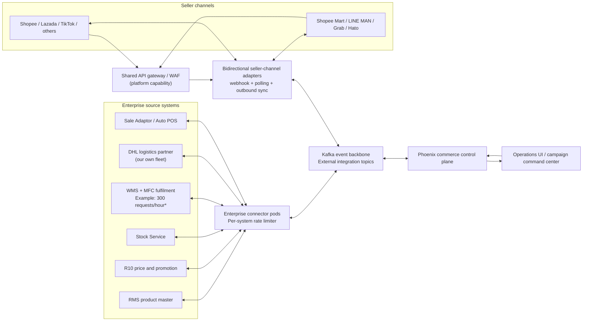
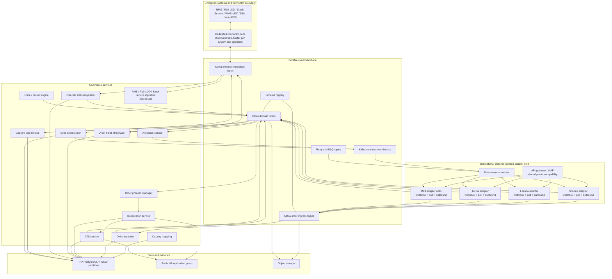
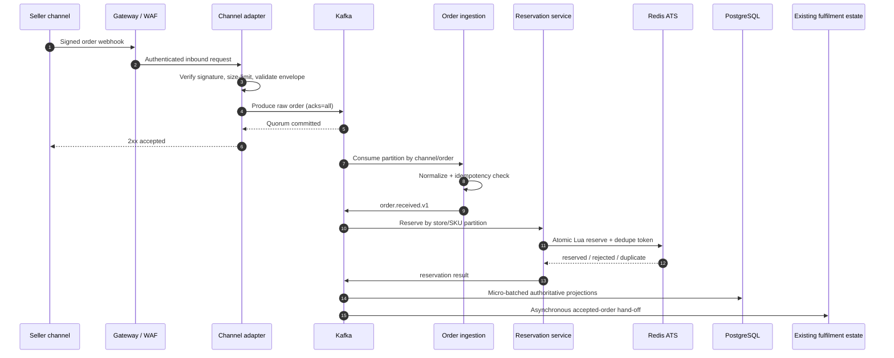
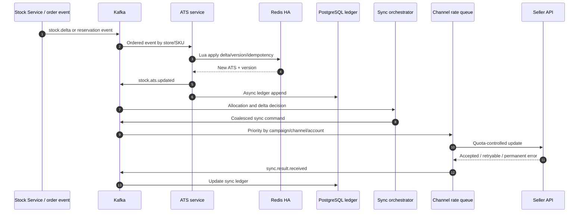
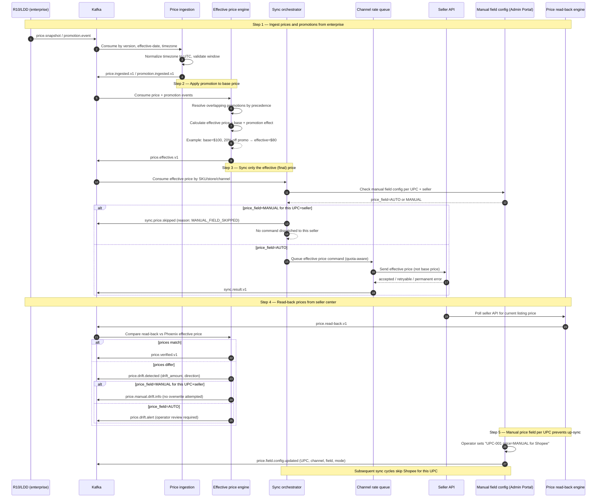
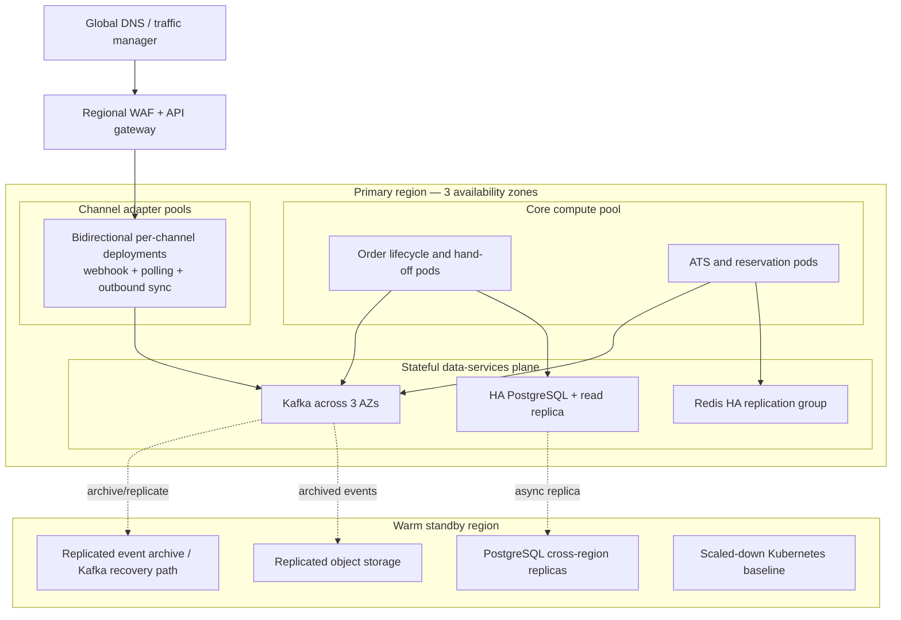

# Phoenix Target Architecture — 50k Orders/Day, 250 Orders/Second Peak

Status: Proposed target-state architecture  
Audience: Platform Engineering, Software Engineering, SRE, Security, QA  
Source: `phoenix-multi-channel-marketplace-proposal.md`  
Three-year forecast: 50,000 orders/day peak; 250 accepted orders/second for no more than 2 minutes

## 1. Executive decision

Phoenix will be an event-driven commerce control plane built with the proposal stack:

- Go microservices for ingestion, inventory, order lifecycle, and seller-channel workloads.
- Kafka as the durable ingress log, orchestration backbone, replay mechanism, and surge buffer.
- A highly available Redis replication group for atomic ATS and short-lived reservation state, using a cluster-ready key model.
- Highly available PostgreSQL with native time partitioning for authoritative business state, ledgers, configuration, and idempotency; no application-level sharding at forecast volume.
- Object storage for immutable source payloads, archive, replay, and reconciliation evidence.
- OpenSearch for application and platform log search only; operational state remains in PostgreSQL and telemetry backends.
- React and Next.js for the operations control plane.
- Kubernetes as the deployment and scaling substrate, with independent workload pools and failure domains.

The core design rule is to separate **acceptance capacity** from **seller-channel delivery capacity**. Phoenix can durably accept a 250 orders/second peak for two minutes, but no architecture can force Shopee, Lazada, TikTok, or mart APIs to accept updates faster than their quotas. Outbound synchronization therefore has bounded, priority-aware queues per seller account and channel, with explicit backlog SLAs and reconciliation.

The logical architecture is unchanged from the higher-volume design. The revised forecast materially reduces deployment quantities, partition counts, storage, and database complexity—not service boundaries, event contracts, consistency guarantees, or failure-isolation patterns. Application-level PostgreSQL sharding is removed because it would add operational cost without improving the forecast SLOs.

### 1.1 Explicit scope boundary

Phoenix includes seller order ingestion, canonical order lifecycle, ATS reservation/release, hand-off to the existing external fulfilment estate, ingestion of external status events, and seller-channel status synchronization.

The following are explicitly out of scope:

- WMS operations and screens, including PO/BOL receiving, IBT workflow, picking, packing, printing, AWB generation, pallet, truck, and warehouse task management.
- Replacement or redesign of the existing WMS. Phoenix integrates through versioned asynchronous contracts only.
- ClickHouse or any analytical data warehouse.
- Business Intelligence, management reporting, data marts, executive analytics, and ad-hoc analytical workloads.

Operational observability, campaign readiness, queue health, reconciliation, and incident dashboards remain in scope because they are required to operate the synchronization platform safely; they are not BI deliverables.

## 2. Scope and capacity contract

### 2.1 Forecast and sizing basis

Capacity is sized from daily volume for retention and storage, and from the two-minute rate for throughput and concurrency:

| Parameter | Design value |
|---|---:|
| Peak daily orders | 50,000 orders/day |
| Three-year order count at daily peak | 54.75 million orders |
| Peak accepted order rate | 250 orders/s |
| Maximum peak window | 2 minutes |
| Peak-window orders | 30,000 orders |
| Burst test headroom | 2x peak rate for 2 minutes |
| Average normalized order envelope | 2 KiB |
| Assumed average order lines | 5; validate from production data |
| Peak line-item rate | Approximately 1,250 lines/s before retry/event amplification |
| Order lifecycle events | 6–10 per order |
| Product catalog | 200,000 SKUs, unchanged |
| Mart footprint | Up to 2,000 stores × 10,000 SKUs; 20 million potential store-SKU records |
| Availability zone failure tolerance | One zone without loss of committed orders |
| Campaign capacity safety factor | 2x throughput test for the full two-minute peak |

At 2 KiB per normalized order, peak ingress is about 0.5 MB/s before Kafka replication and protocol overhead. A full two-minute peak contributes about 60 MB of normalized order payloads, or roughly 180 MB with replication factor 3, before lifecycle events. At 50,000 orders/day, normalized order ingress is about 100 MB/day before replication. Retention, disk, and network sizing must still use measured payloads and the expected 6–10 lifecycle events per order.

At the projected daily peak for all three years, Phoenix retains approximately 54.75 million orders. Assuming roughly 4 KiB of authoritative order data plus indexes, five 1 KiB order lines on average, and lifecycle/audit records, plan an initial three-year PostgreSQL envelope of 1–2 TB including operational headroom. Validate this estimate with actual basket size, index design, retention, and payload sampling before procurement.

The reduced order forecast does not reduce product, price, promotion, or mart stock fan-out. The potential 20 million store-SKU footprint remains the dominant bulk-synchronization workload. Phoenix must therefore retain delta processing, channel-isolated queues, rate-aware scheduling, store/date partitioning, and snapshot reconciliation even though the order plane is physically smaller.

### 2.2 Service-level objectives

| Capability | SLO | Measurement boundary |
|---|---:|---|
| Order acceptance | p99 ≤ 250 ms at 250/s | Edge receipt to Kafka quorum acknowledgement |
| Order ingestion availability | 99.99% monthly | Excludes invalid requests and seller outage |
| Duplicate suppression | 100% for same channel/order/version key | Normalized order projection |
| Reservation decision | p99 ≤ 750 ms; p99.9 ≤ 2 s | Kafka acceptance to reservation outcome |
| Internal order visibility | p99 ≤ 3 s | Acceptance to query projection |
| Stock update for campaign SKUs | p95 ≤ 15 s only while quota-aware drain capacity permits | ATS change to seller acceptance |
| General changed-stock sync | p95 ≤ 60 s only while quota-aware drain capacity permits | ATS change to seller acceptance |
| Price/promotion changed SKU | p95 ≤ 5 min only when the changed set fits the certified quota and batch envelope | Source acceptance to seller acceptance |
| Seller outbound capacity | Plan at 80 of 100 requests/minute; bulk size observed at runtime, maximum 100 but not guaranteed | Per channel/account/endpoint quota scope |
| Capture sale | p95 ≤ 5 s | Eligible request to result |
| Recovery point objective | 0 committed Kafka events; ≤ 1 min derived-state exposure | Region-local failure |
| Recovery time objective | ≤ 15 min AZ; ≤ 60 min regional failover | From incident declaration |

Seller-caused latency is reported separately as `platform_wait_time`; it must never be hidden inside Phoenix processing time.

### 2.3 Scaling decision summary

| Area | Revised decision | Reason |
|---|---|---|
| Logical services and events | Keep unchanged | Correctness, replay, and channel isolation are business requirements, not throughput luxuries |
| Kafka | Three-broker, three-AZ HA floor; 12–96 partitions by topic class | 250/s is modest, but durable quorum and ordered parallelism remain required |
| PostgreSQL | One HA cluster with the existing OMS monthly partitions and optional read replica | Reuse the delivered order design; 54.75 million orders over three years does not justify application sharding |
| Redis ATS | One primary plus two replicas; cluster-ready keys | Throughput is modest; HA and deterministic recovery matter more than horizontal scale |
| Kubernetes | One three-AZ stateless pool, minimum three workers; HPA for peak | Avoid idle specialized pools while preserving AZ resilience |
| Object storage | Retain raw/archive/reconciliation evidence | Cheap replay and audit remain valuable at any order rate |
| Product/stock synchronization | Keep delta fan-out and channel cells | The unchanged 200k catalog and 20 million potential store-SKU footprint dominate bulk work |

## 3. System context



`*` The MFC limit of 300 requests/hour is a working example and must be confirmed with the owning team. Every enterprise dependency requires its own certified quota scope, request budget, concurrency limit, retry policy, and bulk capability.

## 4. Logical architecture

Editable diagrams.net source: [`phoenix-high-level-architecture.drawio`](phoenix-high-level-architecture.drawio).



### 4.1 Workload planes

| Plane | Responsibilities | Scaling key | Isolation rule |
|---|---|---|---|
| Channel ingress | Channel adapters receive authenticated webhooks or poll with overlap-safe cursors, perform lightweight envelope checks, archive raw payloads, and append to Kafka | Channel account and order ID | Never waits for PostgreSQL, Redis, external fulfilment, or outbound seller API calls |
| Order | Idempotency, lifecycle state, process management | `hash(channel_account_id, order_id)` | Partition ordering per order |
| Inventory | Reservation, release, ATS, allocation | `hash(store_id, sku_id)` | Single ordered writer per inventory key |
| External hand-off | Deliver accepted orders to the existing fulfilment estate and consume canonical status events | Order ID | Phoenix owns no warehouse workflow or WMS state |
| Sync | Stock, price, promo, status fan-out | Channel + seller account + entity key | Independent channel delivery cells |
| Query/ops | Operational projections, campaign dashboards, reconciliation | Tenant/date/query dimension | Cannot consume transactional database capacity without limits |

## 5. Critical runtime flows

### 5.1 Order down-sync: seller channel to Phoenix



The channel adapter returns the webhook response only after Kafka confirms durable acceptance; this does not mean external fulfilment has completed. Invalid signatures and malformed envelopes are rejected synchronously. Canonical normalization, idempotency, and all business decisions run asynchronously in `order-ingestion-service` after Kafka.

For polling-only channels, the same channel-adapter deployment uses distributed leases and overlap-safe cursors. Every result enters the same raw order topic and follows the same idempotent flow. Inbound and outbound adapter workers use separate concurrency pools so webhook bursts cannot starve required seller updates.

### 5.2 Stock up-sync: Phoenix to seller channels



Pending stock updates for the same channel/store/SKU are compacted to the newest desired version before transmission. Orders and status transitions are never coalesced.

### 5.3 Price and promotion up-sync

The price and promotion sync workflow follows a five-step pipeline from enterprise ingestion through to seller-channel delivery, with read-back verification and manual-override governance.



**Step 1 — Ingest prices and promotions from R10/LDD:** R10 snapshot and LDD promotion events are consumed from Kafka, with timezone normalization to UTC, effective-date window validation, and deterministic version comparison. Stale source versions are rejected. Promotions carry precedence, clubpack multipliers, ownership tags (Auto/Manual), and guardrail thresholds.

**Step 2 — Apply promotion to base price:** The effective price engine combines the base price with all active promotions at a given business timestamp. Overlapping promotions are resolved by precedence (higher wins). The engine handles percentage discounts (`base × (1 − pct)`), fixed discounts (`base − amount`), clubpack multiplication (`base × multiplicand`), and no-promotion fallback (`base`). Prices outside their effective window or quarantined by guardrails (>50% drop, >10× increase) are not published to channels.

**Step 3 — Sync only the effective (final) price to seller marketplaces:** The sync orchestrator reads the effective price and checks the manual field configuration before dispatching. If `price_field=MANUAL` is set for a specific UPC on a specific seller channel, the price command is skipped for that channel and a `MANUAL_FIELD_SKIPPED` governance event is emitted. If `AUTO`, the effective price (not the base price) is queued through the quota-aware scheduler and dispatched via the adapter SDK. Each command records `desired_price`, `effective_price`, `payload_hash`, and `reconciliation_key`.

**Step 4 — Read-back prices from seller center:** A periodic read-back process polls each seller's API for current listing prices and compares them against Phoenix's desired effective price. Matches are marked `PRICE_VERIFIED`. Drift triggers a `PRICE_DRIFT_DETECTED` alert. If the UPC has `price_field=MANUAL` for that seller, the drift is logged as informational only and no overwrite is attempted — preserving the seller-centre price set by the operator.

**Step 5 — Manual price field per UPC prevents up-sync:** Operators configure per-UPC, per-channel, per-field mode (Auto/Manual) through the Admin Portal (a4). When a price field is set to `MANUAL` for a specific UPC and seller, all up-sync of that field to that seller is suppressed — even if the R10/LDD source price changes. The same UPC can have `price_field=AUTO` for another seller and continue syncing normally. The configuration is effective-dated, versioned, and fully audited.

### 5.4 Order status up-sync

The existing fulfilment estate emits canonical status events through the Phoenix integration contract. Phoenix does not execute warehouse operations. A channel-specific state machine maps external canonical states to permitted seller transitions. The adapter rejects backward or impossible transitions locally, sends only the next legal state, and records platform acknowledgement. Reconciliation detects seller/Phoenix divergence and raises an operations task.

## 6. Event and consistency model

### 6.1 Delivery semantics

Kafka and external APIs provide at-least-once delivery. Phoenix achieves **effectively-once business outcomes** through:

1. Stable event IDs generated at first acceptance.
2. Idempotency keys scoped by operation, aggregate, and version.
3. Partition ordering for each business aggregate.
4. Atomic Redis Lua operations for inventory mutations.
5. PostgreSQL unique constraints on authoritative outcomes.
6. Transactional outbox for database-originated events.
7. Inbox/dedup tables for consumers whose outcome is committed to PostgreSQL.
8. Adapter request keys and payload hashes for external retries.

Do not attempt distributed two-phase commit across Kafka, Redis, PostgreSQL, and seller APIs.

### 6.2 Event envelope

Every event uses a versioned Protobuf or Avro contract registered in the schema registry:

```text
event_id, event_type, schema_version, occurred_at, accepted_at,
producer, correlation_id, causation_id, trace_id,
channel_id, seller_account_id, aggregate_type, aggregate_id,
aggregate_version, partition_key, idempotency_key,
campaign_id, priority, deadline_at, payload, pii_classification
```

Compatibility is backward by default. Breaking changes require a new topic or dual-publish migration. Events carry no secrets and minimize customer PII.

### 6.3 Ordering keys

| Event family | Partition key | Guarantee |
|---|---|---|
| Raw/normalized orders | `channel_account_id + order_id` | Lifecycle order per seller order |
| Inventory movements | `store_id + sku_id` | Deterministic ATS calculation |
| Reservations | `store_id + sku_id` | Serialize competing deductions |
| External order status | `order_id` | Legal seller-facing state transitions |
| Seller sync commands | `channel + account + entity_id` | Desired-version ordering |

Global ordering is intentionally not provided.

### 6.4 Retry taxonomy

- Immediate retry: transient connection reset, bounded to a few attempts with jitter.
- Deferred retry: rate limit, platform 5xx, dependency outage; retry topics with increasing delay.
- Business exception: missing mapping, invalid transition, insufficient ATS; operations queue.
- Permanent failure: invalid platform payload or revoked entity; DLQ with remediation reason.
- Poison event: contract/handler defect; quarantine topic, alert, and replay after correction.

Retries have a maximum age and attempt budget. A retry storm must not outrank new paid orders or campaign stock protection.

## 7. Kafka design and initial sizing

### 7.1 Topic classes

Use versioned topics and separate traffic classes:

- `raw.order.accepted.v1` — immutable seller payload reference and adapter-validated transport envelope; canonical normalization occurs in order ingestion.
- `order.lifecycle.v1` — canonical order transitions.
- `inventory.movement.v1` and `inventory.reservation.v1` — stock-affecting commands.
- `inventory.ats.v1` and `allocation.changed.v1` — calculated state.
- `sync.stock.<channel>.v1`, `sync.price-promo.<channel>.v1`, `sync.order-status.<channel>.v1` — channel-isolated delivery.
- `sync.result.v1` — normalized external results.
- Domain-specific `.retry.<delay>.v1` and `.dlq.v1` topics.

### 7.2 Initial production envelope

The following is a benchmark starting point, not a procurement quote:

| Item | Initial envelope |
|---|---|
| Kafka brokers | 3 across 3 independent failure domains |
| Replication | RF=3, `min.insync.replicas=2`, producer `acks=all` |
| Broker storage | Start at 500 GB usable per broker; validate with measured lifecycle amplification and retention |
| Raw order partitions | 12–24 |
| Order lifecycle partitions | 24–48 |
| Inventory/reservation partitions | 48–96 due to line-item amplification and hot-key isolation |
| Channel sync partitions | 3–6 per channel; seller quota, not Kafka, limits delivery throughput |
| Compression | Zstd for storage-heavy streams; LZ4 where latency testing favors it |
| Raw order retention | 7 days hot, then object storage archive |
| Domain retention | 7–14 days hot according to replay requirement |
| Consumer lag reserve | At least 24 hours of projected peak-day traffic |

Partition counts must be validated with real message size, line-item count, key skew, encryption, replication, and failure-mode tests. Keep campaign hot keys from overwhelming one partition by routing reservation work at store/SKU granularity while retaining order-level process state separately.

### 7.3 Backpressure

- Edge admission uses per-channel quotas and protects a reserved campaign capacity pool.
- Producers fail closed if Kafka cannot reach quorum; they do not silently accept orders to memory.
- Consumers pause partitions before PostgreSQL or Redis saturation.
- Kafka lag drives horizontal scaling for internal consumers, but seller-adapter replicas are capped because additional pods cannot increase external quota.
- Seller queues scale to quota, not backlog size. Extra workers cannot exceed seller limits.
- Low-priority catalog/full-reconciliation traffic pauses automatically during campaign protection mode.

## 8. Data architecture

### 8.1 PostgreSQL topology

Use one highly available PostgreSQL cluster with a primary and synchronous or near-synchronous standby across availability zones. Isolate domains with databases/schemas, roles, connection pools, and native table partitions. Add read replicas for operational queries as measured demand requires:

| Domain | Data | Physical design |
|---|---|---|
| Orders | Order headers, lines, lifecycle, packages, external hand-off and status references | Adopt the monthly range partitions already implemented by `phoenix-oms-mkp-service` |
| Inventory ledger | Durable movements, reservation outcomes, reconciliation | Monthly partitions initially; move to weekly/daily only if measured growth requires it |
| Sync ledger | Desired/sent/accepted versions, attempts, errors | Monthly partitions with retention/archive policy |
| Catalog/config | Product, mapping, channel policy, campaign config | Read replicas and cache; lower write volume |
| Operations | Exception tasks, cutover state, approvals | Dedicated schema/roles and bounded query pool |

Do not introduce an application shard router at the forecast volume. Keep stable aggregate keys and repository interfaces so a later sharding migration is possible, but defer physical sharding until measured sustained writes, database size, vacuum pressure, or recovery time cannot meet SLOs after vertical scaling, indexing, and native partitioning have been exhausted.

#### Existing OMS order-partition baseline

The order domain is not a greenfield database design. Phoenix adopts the implementation already delivered in the sibling `phoenix-oms-mkp-service` repository:

| Table | Existing partition design |
|---|---|
| `orders` | Monthly range partition on `created_at`; composite primary key `(id, created_at)` |
| `order_items` | Monthly range partition on `order_created_at`; composite primary key `(id, order_created_at)` |
| `order_status_history` | Monthly range partition on `created_at`; composite primary key `(id, created_at)` |
| `packages` | Monthly range partition on `order_created_at`; composite primary key `(id, order_created_at)` |
| `order_refs` | Non-partitioned global lookup keyed by `order_id_ref`, carrying `order_id` and `created_at` |
| `package_refs` | Non-partitioned global lookup keyed by `package_id`, carrying `order_id` and `order_created_at` |

The lookup tables solve two PostgreSQL partitioning constraints: global business-key uniqueness cannot be enforced by a partitioned-table unique index unless the partition key is included, and point lookups need the partition timestamp for pruning. Repository queries must therefore resolve the reference first and query the partitioned table using both ID and time key.

Implemented OMS mechanics:

- Default partitions exist as safety nets for all four partitioned tables.
- The idempotent internal partition controller creates partitions for the next three months across all four partitioned tables and is designed for monthly scheduler invocation.
- Parent-table indexes create corresponding partition indexes. Uniqueness on `order_items` includes `order_created_at`.
- Partition-aware queries always include `created_at` or `order_created_at`; missing the key is treated as a performance defect.
- Historical archive uses the guarded OMS script: it refuses current/future months, deletes reference rows transactionally, and then drops the selected monthly partitions.

Required production operationalization:

- Assign scheduler ownership and alert if the three-month future-partition horizon is not maintained.
- Alert on default-partition rows and move them into the correct monthly partition.
- Monitor per-partition size/bloat, query pruning, archive success, and reference-table integrity.
- Rehearse archive and restore; the existing script drops eligible partitions but does not by itself provide an external retained copy or restore workflow.

Implementation references: [`ARCHITECTURE.md`](../../phoenix-oms-mkp-service/ARCHITECTURE.md), [`20260429000000_create_orders_tables.up.sql`](../../phoenix-oms-mkp-service/migrations/20260429000000_create_orders_tables.up.sql), [`20260506000000_production_hardening.up.sql`](../../phoenix-oms-mkp-service/migrations/20260506000000_production_hardening.up.sql), [`partition/controller.go`](../../phoenix-oms-mkp-service/internal/partition/controller.go), and [`archive_partition.sql`](../../phoenix-oms-mkp-service/scripts/archive_partition.sql).

At peak, do not issue one synchronous SQL transaction per accepted order. Kafka consumers batch projection writes, use prepared multi-row statements or binary copy, and keep batches small enough to meet visibility SLOs. PostgreSQL remains the authoritative business state; Kafka is the ordered durability and recovery buffer that allows the database to absorb the peak safely.

Required controls:

- Preserve global order/package uniqueness through the existing non-partitioned `order_refs` and `package_refs` tables; retain operation-level idempotency keys for other commands.
- Optimistic aggregate versions to reject stale transitions.
- Keep transactions bounded to one aggregate/domain operation; avoid cross-domain distributed transactions.
- Read replicas for operations queries; no dashboard scans on primaries.
- Retain and operationalize the OMS controller that idempotently creates three future monthly partitions.
- PgBouncer transaction pooling and strict connection budgets.
- Point-in-time recovery, cross-region replica or backup restore, and tested monthly partition archive/restore.

### 8.2 Redis high availability and cluster-ready topology

Use separate Redis deployments for inventory/reservations and disposable caches/rate counters. Never allow cache eviction policy to affect ATS.

ATS key locality uses hash tags such as `{store:sku}` so ATS, active reservations, version, and dedup metadata required by one Lua operation share a slot. Lua scripts are bounded, deterministic, and versioned. They:

1. Validate event/idempotency token.
2. Compare expected source and aggregate versions.
3. Apply ERP movement, reserve, release, damage, or safety-stock change.
4. Enforce configured floor and invariants.
5. Return the new ATS and version.

Reservation keys use TTL only as a trigger; expiry processing emits a durable release command. Keyspace notifications alone are not a correctness mechanism. Redis persistence uses AOF and replicas, but PostgreSQL ledger plus Kafka replay is the recovery source.

Initial capacity should assume at least 2x peak memory and operations headroom after failover, with no primary above 50% of its tested command capacity during campaigns.

Begin with one inventory primary and two replicas distributed across three availability zones, or an equivalent highly available topology. The key model remains Redis Cluster-compatible so horizontal sharding can be enabled later. Add primary shards only when measured memory, hot store/SKU skew, Lua latency, or failover behavior requires them.

### 8.3 Object storage and operational search

- Store raw source snapshots, seller payloads, large request/response bodies, Kafka archive, and reconciliation exports in encrypted object storage.
- PostgreSQL rows contain object references and hashes rather than unbounded payload blobs.
- Send application and platform logs to OpenSearch with short, policy-controlled retention.
- Build operational dashboards from metrics/traces and bounded PostgreSQL read models or replicas; do not create an analytical warehouse or ad-hoc BI query path.
- Keep authoritative business audit and reconciliation evidence in PostgreSQL ledgers and object storage.
- Apply PII retention and deletion policy independently from operational telemetry.

## 9. Seller-channel delivery architecture

Each seller channel is an independently deployable **delivery cell** containing:

- Command consumer and desired-state coalescer.
- Account-aware token-bucket limiter stored in Redis.
- Weighted fair scheduler.
- Channel adapter workers.
- Circuit breaker and health scorer.
- Result publisher, retry processor, and DLQ handler.
- Channel-specific dashboards and kill switch.

Priority classes, highest first:

1. Paid order acknowledgement and required status transition.
2. Reservation-driven stock reduction and oversell protection.
3. Campaign price/promotion and top-SKU stock.
4. General stock changes.
5. Product/catalog changes.
6. Full reconciliation and repair.

Fairness is enforced across seller accounts so one large account cannot starve others. A command deadline is used for alerting and prioritization, never for silent deletion.

### 9.1 External dependency and seller-channel rate limits

Rate limiting applies on both sides of Kafka. Enterprise connector pods protect RMS, R10/LDD, Stock Service, WMS/MFC, DHL, and Auto POS; seller adapter pods protect each marketplace API. Kafka absorbs bursts and provides replay, but consumers must be paced by the downstream system's certified quota rather than by Kafka lag or pod count.

| External dependency | Provisional request budget | Required discovery before production |
|---|---:|---|
| WMS/MFC | 300 requests/hour example | Confirm whether the quota is global or scoped by endpoint, operation, credential, facility, and request direction |
| RMS | Unknown | Rate, concurrency, payload/bulk limits, retry timing, maintenance windows |
| R10/LDD | Unknown | Rate, concurrency, payload/bulk limits, retry timing, effective-date behavior |
| Stock Service | Unknown | Event/poll limits, snapshot constraints, replay behavior, retry timing |
| DHL | Unknown | Rate, concurrency, shipment/status endpoint limits, webhook behavior |
| Auto POS | Unknown | Rate, concurrency, idempotency rules, timeout and retry behavior |

Each connector uses an independently configured distributed token bucket and retry budget. Autoscaling increases availability and processing concurrency only within that budget; it must never multiply calls beyond the dependency contract.

Initial seller-channel constraint until a certified contract proves otherwise:

| Parameter | Planning value |
|---|---:|
| Maximum request rate | 100 requests/minute per quota scope |
| Normal operating budget | 80 requests/minute |
| Reserved retry/urgent budget | 20 requests/minute |
| Advertised bulk maximum | Up to 100 items/request |
| Guaranteed bulk size | Unknown; discover and configure per channel, account, endpoint, and operation |

The quota scope must be confirmed during adapter certification: it may apply globally, per channel, seller account, credential, endpoint, or operation. Capacity cannot be multiplied across accounts until the platform contract confirms that behavior.

At 100 requests/minute, theoretical capacity varies sharply with the effective batch size:

| Effective batch size | Theoretical items/minute | Ideal time for 20,000 changed items |
|---:|---:|---:|
| 100 | 10,000 | 2 minutes |
| 50 | 5,000 | 4 minutes |
| 20 | 2,000 | 10 minutes |
| 1 | 100 | 200 minutes |

Production planning uses 80 requests/minute and observed batch fill/success rate, not the theoretical maximum.

For each channel operation, Platform Engineering must maintain:

```text
effective_items_per_minute = 80 × observed_batch_fill × observed_success_ratio
drain_minutes = pending_items / effective_items_per_minute
campaign_headroom = allowed_completion_minutes / drain_minutes
```

If campaign headroom is below 1.5, the release gate fails. Remedies are changed-SKU filtering, certified larger batches, pre-staging, quota negotiation, or a longer business SLA—not uncontrolled worker scaling.

### 9.2 Adapter runtime configuration

- Run two adapter replicas per channel for availability and start with `maxReplicas: 3`, validated against the 250 orders/second burst test. Additional replicas may improve inbound webhook capacity but never increase the certified outbound API budget.
- Use separate inbound, polling, and outbound worker pools within each adapter so webhook bursts, slow polling calls, and quota-constrained synchronization cannot starve one another.
- Enforce the combined quota across all replicas with an atomic distributed token bucket keyed by channel, account, credential, endpoint, and operation.
- Dynamically configure batch size. Never assume the advertised maximum of 100 is accepted for every operation.
- Coalesce pending stock, price, promotion, and product desired-state updates to the newest version. Never coalesce orders or legal status transitions.
- Back off immediately on `429`, honor server-provided retry timing, and consume retries from the reserved quota budget.
- Alert on estimated drain time and missed command deadline rather than raw Kafka lag alone.

## 10. Kubernetes and platform topology



Platform requirements:

- Start with one general-purpose stateless node pool spread across three AZs, with at least three worker nodes and enough spare capacity to lose one AZ. Add dedicated adapter or batch pools only when noisy-neighbor measurements justify them.
- Run at least two replicas of every critical stateless service. Channel-adapter replicas provide inbound HA and are spread across availability zones.
- Pod anti-affinity and topology spread across all three AZs.
- Pod disruption budgets and graceful Kafka partition revocation.
- Horizontal scaling from CPU plus Kafka lag and request rate; scheduled pre-scaling before campaigns.
- For seller adapters, use inbound request rate, CPU, latency, and error health for autoscaling and start with `minReplicas: 2`, `maxReplicas: 3`; do not scale from outbound Kafka lag alone.
- Resource requests/limits based on load tests; no unbounded Go goroutines or connection pools.
- Autoscaling disabled from scaling below campaign minimums during protection windows.
- GitOps deployment, immutable images, signed artifacts, and environment promotion.
- Progressive canary by channel/account/SKU scope, with automated SLO rollback.
- Separate namespaces and service accounts per domain; default-deny network policies.

Stateful components may run on the shared platform or on a separately operated data-services plane. Select the delivery model from SLO, recovery, isolation, security, and lifecycle requirements; the architecture does not depend on a specific cloud provider.

## 11. Availability, resilience, and disaster recovery

### 11.1 Failure behavior

| Failure | Expected behavior |
|---|---|
| One service pod/node | Retry from Kafka; no business loss |
| One availability zone | Kafka and stores retain quorum; traffic shifts; SLO may degrade but orders continue |
| PostgreSQL primary unavailable | Ingress continues into Kafka during automatic failover; projections pause until the new primary is writable |
| Redis primary failover | Reservation partition pauses briefly; no blind fallback to stale cache |
| Seller API outage | Its circuit opens; commands remain durable; other channels continue |
| Bad adapter release | Canary rollback and per-channel kill switch; commands replay after fix |
| Poison event | Quarantine only the affected partition/event with operator visibility |
| Regional outage | Controlled failover using fencing epoch; prevent dual writers |

### 11.2 Regional DR

Use active/passive write ownership initially. Global traffic management directs writes to one fenced region. PostgreSQL streams to a warm regional replica or supports tested point-in-time restoration; object storage replicates; Kafka events are archived/replicated to the recovery region. Failover requires an incident command decision, promotion of the recovery database, incrementing the regional writer epoch, Kafka offset/replay validation, and traffic switch. Exercise this quarterly.

Active/active inventory mutation is deliberately excluded until the business accepts the conflict model. It adds correctness risk without helping seller API quotas.

## 12. Security and compliance

- Authenticate channel webhooks with signature, timestamp, nonce, and replay-window validation.
- Use OAuth/OIDC for users, workload identity for services, and mTLS for service-to-service traffic where the platform supports it.
- Keep seller credentials in a secrets manager; rotate and audit access. Never place secrets in Kafka events or logs.
- Encrypt data in transit and at rest, including Kafka, PostgreSQL, Redis persistence, backups, and object storage.
- Tokenize or field-encrypt customer PII; restrict decryption by workload identity.
- Enforce least-privilege topic, schema, database, object, and Kubernetes RBAC.
- Record immutable admin actions, manual retries, mapping changes, overrides, and cutover switches.
- Add WAF rules, payload limits, decompression limits, and per-channel abuse controls.
- Run SAST, dependency/image scanning, SBOM generation, secret scanning, and signed deployment admission.

## 13. Observability and operations

Use OpenTelemetry in every Go and Next.js service. Preserve `trace_id`, `correlation_id`, order ID, campaign ID, and seller account across HTTP, Kafka headers, and ledgers.

### 13.1 Golden signals

- Adapter ingress: accepted/rejected webhook and poll rate, p50/p95/p99 latency, signature failures, cursor lag, Kafka produce errors, and worker-pool saturation.
- Kafka: bytes/s, records/s, under-replicated partitions, consumer lag age, hot partitions, rebalance time.
- Orders: duplicate rate, lifecycle age, invalid transition, reservation latency and rejection reason.
- Inventory: Redis operations/latency, Lua error, negative-floor attempt, ledger lag, reconciliation drift.
- PostgreSQL: transactions/s, WAL rate, replica lag, lock time, connection saturation, monthly partition growth, future-partition horizon, default-partition rows, and partition-pruning ratio.
- Channels: quota use against 100 requests/minute, observed batch fill, effective items/minute, estimated drain time, queue age by priority, `429` rate, success/error class, circuit state, and seller acceptance latency.
- Operational outcomes: campaign eligible/pending/failed SKU, oversell attributed to internal delay, and orders requiring intervention.

### 13.2 SLO burn alerts

Use multi-window burn-rate alerts rather than static threshold noise. Page on imminent order loss, quorum loss, reservation correctness, or rapid SLO burn. Ticket on long-tail backlog and reconciliation drift. Dashboard every latency as:

```text
source_delay + phoenix_queue + phoenix_processing + platform_wait + platform_processing
```

### 13.3 Campaign command center

The operations UI must show:

- Current versus forecast rate and tested capacity.
- Kafka lag age by domain and priority.
- Redis node and PostgreSQL saturation.
- Seller quota headroom and oldest command age.
- Price, promotion, stock, and order-status readiness.
- DLQ/business exception counts with owner and remediation.
- Channel kill switches and Phoenix/legacy write ownership.
- Reconciliation drift and platform-attributed delay.

## 14. Deployment, migration, and release safety

Use the strangler sequence from the proposal:

1. Observe legacy flows and mirror events without writes.
2. Shadow-calculate and reconcile price/promotion output.
3. Enable scoped price/promo writes by channel and SKU allowlist.
4. Shadow ATS and reservation decisions.
5. Enable ATS for one channel/account/store cohort, then expand.
6. Move order ingestion, external hand-off, and seller status sync by channel cohort.
7. Roll out mart store fan-out in isolated cells.
8. Retire legacy ownership only after stable reconciliation windows.

Every cutover has one explicit writer. Feature flags are keyed by domain, channel, seller account, store, and SKU cohort. Rollback stops new Phoenix external writes but does not delete events or ledger history. Reprocessing uses a new replay run ID and the same business idempotency rules.

## 15. Verification strategy

### 15.1 Required test stages

| Stage | Exit criterion |
|---|---|
| Contract | Backward-compatible event/API schemas; certified adapter fixtures |
| Seller quota | Combined replicas remain within 100 requests/minute; batch sizes 1/20/50/100, `429`, retry reserve, and drain-time calculations pass |
| Component | Idempotency, state-machine, and Lua invariant tests |
| Integration | Kafka/Redis/PostgreSQL failure and retry behavior |
| Partition lifecycle | OMS controller idempotency, three-month look-ahead, default-partition alerting, pruning, guarded archive, and restore |
| Shadow | Phoenix output reconciles with legacy at agreed tolerance |
| Load | Daily profile representing 50k orders/day, 250/s for 2 minutes, and 500/s for 2 minutes as burst headroom, with realistic line-item skew |
| Soak | 24-hour normal plus campaign ramp; no unbounded lag/memory/storage growth |
| Chaos | Broker, AZ, Redis primary, PostgreSQL primary, adapter, and network failures |
| DR | Regional failover and replay meet RPO/RTO |
| Business simulation | Double-date price, promo, stock, order, cancel, and seller outage scenario |

### 15.2 Load-test acceptance

- No acknowledged order is lost.
- Duplicate delivery produces one business outcome.
- p99 acceptance and reservation SLOs are met.
- Consumer lag returns to baseline within the agreed recovery window.
- One-AZ loss retains Kafka/store quorum and at least 250/s acceptance or the agreed degraded capacity.
- PostgreSQL and Redis remain below failover-safe saturation.
- All OMS order tables have at least three future monthly partitions, no unexplained default-partition rows, and partition-aware query plans.
- Seller queues honor quotas, priorities, fairness, and coalescing rules.
- Two or three adapter replicas collectively remain within the configured quota, including during restart, rebalance, and retry storms.
- Replaying the test produces identical final order and ATS states.

Test data must model hot SKUs, large baskets, retries, out-of-order seller events, duplicate webhooks, cancellations, reservation expiry, and skewed seller accounts. Uniform random traffic gives dangerously optimistic results.

## 16. Engineering ownership and repository boundaries

Recommended bounded contexts:

```text
/services
  /order-ingestion
  /order-process-manager
  /reservation
  /ats
  /allocation
  /order-handoff
  /external-status-ingestion
  /capture-sale
  /catalog-mapping
  /price-promo
  /sync-orchestrator
  /channel-adapter-{channel}
  /admin-api
/web/admin
/contracts/{events,apis}
/platform/{kubernetes,gitops,observability,load-test}
/libraries/go/{eventing,idempotency,telemetry,postgres,channel-sdk}
/runbooks
/adr
```

Shared libraries provide mechanics, not domain behavior. Channel-specific mapping and retry classification remain inside adapters. Database schemas and Kafka topics have a named owning team; consumers cannot read another service’s tables directly.

### 16.1 Team ownership

| Team | Owns |
|---|---|
| Order lifecycle | Post-Kafka canonical normalization and idempotency, reservation coordination, external hand-off, external status ingestion, sale capture |
| Inventory | ATS, reservation, stock ledger, allocation |
| Channel integration | Sync orchestration, adapters, quota scheduling, certification lab |
| Platform/SRE | Kubernetes, Kafka, Redis, PostgreSQL platform, CI/CD, telemetry, DR |
| Operations product | Admin API/UI, campaign command center, exception workflows |

## 17. Architecture decisions to lock before build

1. Confirm that 50,000/day is the highest day and 250/s is accepted orders, not order lines/events, for no more than two minutes.
2. Obtain per-channel/account quotas and supported batch sizes for every operation.
3. Select the ownership, deployment, backup, patching, and failover model for Kafka, PostgreSQL, Redis, and the searchable logging backend.
4. Benchmark Protobuf versus Avro and choose one schema contract standard.
5. Adopt the existing OMS monthly partition contract; approve retention/archive periods, default-partition remediation, scheduler ownership, and measured thresholds for future sharding.
6. Define the canonical order and external-status contract with business and existing fulfilment owners.
7. Define reservation timing by channel status: created, paid, or confirmed.
8. Approve inventory oversell policy, safety stock, and degraded-mode behavior.
9. Approve PII retention, encryption, and regional residency requirements.
10. Define campaign protection mode and who may activate kill switches.

## 18. Implementation slices

| Slice | Deliverable | Production gate |
|---|---|---|
| Foundation | Kubernetes, contracts, Kafka, telemetry, synthetic load generator | One-AZ test and event replay |
| Price/promo pilot | R10 delta, sync ledger, Shopee/Lazada cells, campaign dashboard | Changed-SKU SLA and reconciliation |
| ATS core | Stock Service delta, Redis Lua, ledger, replay, read-only comparison | Deterministic recovery and no negative ATS |
| Reservation | Order ingestion and reservation for one channel cohort | Idempotency and 250/s peak plus 500/s headroom benchmark |
| OMS partition operations | Existing monthly schema, lookup refs, partition scheduler, archive and restore runbooks | Three-month horizon and partition-pruning verification |
| Order hand-off | Existing fulfilment integration, capture sale, external status ingestion, seller status up-sync | End-to-end contract and state-machine certification |
| Marketplace scale | All marketplace channel cells | Quota and isolation tests |
| Mart scale | Store-partitioned allocation and mart cells | 2,000 × 10,000 store-SKU simulation |
| Decommission | Writer cutover, archive, legacy retirement | Stable reconciliation and DR rehearsal |

## 19. Component sizing and cloud cost estimate

This section translates the forecast in Section 2 into a first production sizing envelope and monthly cloud cost estimate. It is a planning baseline, not a procurement quote. Final sizing must be validated with measured payload sizes, line-item skew, channel quota certification, load tests, retention policy, encryption overhead, backup policy, and selected cloud region.

### 19.1 Estimation assumptions

| Assumption | Planning value |
|---|---:|
| Forecast order load | 50,000 orders/day; 250 accepted orders/s for 2 minutes |
| Burst test load | 500 accepted orders/s for 2 minutes |
| Average normalized order envelope | 2 KiB before lifecycle amplification |
| Average order lines | 5 lines/order |
| Product catalog | 200,000 SKUs |
| Mart store-SKU footprint | Up to 20 million potential records |
| Kafka replication | RF=3, `min.insync.replicas=2`, 7-14 days hot retention |
| PostgreSQL retained authoritative data | 1-2 TiB initial three-year envelope plus indexes/headroom |
| Object storage retained evidence | 2 TiB initial planning allocation |
| Admin portal | Existing PAP - Phoenix Admin Portal; no new Admin API or Next.js UI compute in this estimate |
| Availability model | One production region, three availability zones, warm DR storage/backup hooks only |
| Month length for estimates | 730 hours |
| Currency | USD/month, excluding tax, enterprise support, reserved discounts, labor, and major internet egress |

The cost bands below use public on-demand pricing pages and calculators as reference inputs as of 2026-06-30. Validate exact rates in the target region immediately before budget approval:

- AWS: [EKS pricing](https://aws.amazon.com/eks/pricing/), [EC2 pricing](https://aws.amazon.com/ec2/pricing/on-demand/), [MSK pricing](https://aws.amazon.com/msk/pricing/), [RDS for PostgreSQL pricing](https://aws.amazon.com/rds/postgresql/pricing/), [ElastiCache pricing](https://aws.amazon.com/elasticache/pricing/), [OpenSearch Service pricing](https://aws.amazon.com/opensearch-service/pricing/), [S3 pricing](https://aws.amazon.com/s3/pricing/), and the [AWS Pricing Calculator](https://calculator.aws/).
- Tencent Cloud: [TKE pricing](https://www.tencentcloud.com/products/tke/pricing), [CVM pricing](https://www.tencentcloud.com/products/cvm/pricing), [CKafka pricing](https://www.tencentcloud.com/products/ckafka/pricing), [TencentDB for PostgreSQL pricing](https://www.tencentcloud.com/products/postgresql/pricing), [TencentDB for Redis pricing](https://www.tencentcloud.com/products/redis/pricing), [Elasticsearch Service pricing](https://www.tencentcloud.com/products/es/pricing), [COS pricing](https://www.tencentcloud.com/products/cos/pricing), and the [Tencent Cloud pricing calculator](https://buy.intl.cloud.tencent.com/price/calculator).

### 19.2 Baseline component sizing

| Component | Initial production sizing | CPU/RAM envelope | Storage envelope | Scaling trigger |
|---|---|---:|---:|---|
| Kubernetes control plane | Managed control plane where available; self-managed only for special compliance cases | Provider-managed or 3 small control-plane nodes | 100-200 GiB system volume if self-managed | API server latency, node count, admission latency |
| Stateless service worker pool | Start with 6 general-purpose workers across 3 AZs; minimum 2 workers/AZ during campaign windows; autoscale to 12 workers | 12 vCPU / 48 GiB baseline; 24 vCPU / 96 GiB burst | 100 GiB/node ephemeral/system disk | CPU >60%, memory >70%, Kafka lag age, ingress latency |
| Channel adapters | 2 replicas per channel/cell; start `maxReplicas: 3`; separate inbound, polling, and outbound pools | 250-500 mCPU and 512 MiB-1 GiB per replica; 8-16 vCPU aggregate for all cells | Stateless; logs shipped externally | Inbound webhook rate, polling latency, CPU, error health; not outbound lag alone |
| Order lifecycle services | 2-3 replicas each for ingestion, process manager, hand-off, status, capture sale | 6-10 vCPU / 12-24 GiB aggregate | Stateless; PostgreSQL/Kafka hold state | p99 processing latency, consumer lag age, DB write queue |
| Inventory and reservation services | 3 replicas each for reservation, ATS, allocation | 6-10 vCPU / 12-24 GiB aggregate | Stateless; Redis/PostgreSQL hold state | Redis Lua p99, reservation lag, hot store/SKU skew |
| Product, price, promo, sync orchestrator | 2 replicas each; scheduled pre-scale for campaign ingestion | 8-16 vCPU / 16-32 GiB aggregate during campaign processing | Stateless; object storage for snapshots | Snapshot size, delta computation duration, campaign drain forecast |
| Kafka / Redpanda | 3 brokers across 3 AZs | 2-4 vCPU and 8-16 GiB per broker | 500 GiB usable per broker to start; 1.5 TiB cluster raw before replication/accounting | Broker disk >60%, under-replicated partitions, p99 produce latency, lag age |
| Schema registry | 2 replicas | 1-2 vCPU / 2-4 GiB aggregate | Small PostgreSQL/Kafka-backed metadata | Schema lookup latency and availability |
| PostgreSQL authoritative store | HA primary plus standby; optional read replica for operations queries | Start at 4 vCPU / 16 GiB primary class; scale to 8 vCPU / 32 GiB when write/read headroom drops | 2 TiB gp3/premium SSD equivalent; provision IOPS after load test | CPU >60%, WAL rate, lock wait, replica lag, vacuum/bloat, partition growth |
| PgBouncer | 2-3 replicas | 1-2 vCPU / 1-2 GiB aggregate | Stateless | Connection saturation or queueing |
| Redis ATS | 1 primary plus 2 replicas across AZs; cluster-compatible key model | 2 vCPU / 8-13 GiB per node to start | AOF/persistence disk sized at 2x memory if self-managed | Memory >50% after failover, Lua p99, hot-key skew, failover time |
| Redis cache/rate limiter | Separate small HA deployment; do not share with ATS | 1-2 vCPU / 2-4 GiB per node | Disposable persistence optional | Token bucket latency, memory, connection count |
| OpenSearch / Elasticsearch logs | 3 data nodes; short retention; not a business data store | 2 vCPU / 8 GiB per node | 300-500 GiB hot storage to start | Ingest rate, shard pressure, query latency, retention growth |
| Object storage | Cloud object storage bucket(s), versioning and lifecycle policy | N/A | 2 TiB initial; lifecycle raw payloads and archives to colder tiers | Payload/archive growth, reconciliation retention, replay requirements |
| Observability metrics/traces | Managed service or 3-node self-managed stack | 4-8 vCPU / 16-32 GiB aggregate if self-managed | 300-800 GiB depending on trace sampling and retention | Cardinality, ingest cost, query latency |
| Load balancers, WAF, NAT, private endpoints | Regional WAF/API gateway plus internal load balancers | Provider-managed | N/A | Request rate, rule count, cross-AZ/NAT data processing |

### 19.3 Managed cloud estimate

Managed means the major stateful services are provider-operated where practical: managed Kubernetes control plane, managed Kafka, managed PostgreSQL, managed Redis, managed OpenSearch/Elasticsearch, and object storage. Phoenix backend application services still run on Kubernetes worker nodes. PAP - Phoenix Admin Portal is treated as already deployed and is excluded from new compute provisioning.

| Cost area | AWS managed estimate | Tencent Cloud managed estimate | Basis |
|---|---:|---:|---|
| Kubernetes control plane and worker nodes | $400-$750 | $320-$680 | Backend worker pool only; excludes existing PAP Admin API and Next.js UI compute |
| Managed Kafka | $600-$1,200 | $450-$1,000 | 3 broker-equivalent HA cluster, 1.5 TiB hot storage, modest throughput |
| Managed PostgreSQL | $900-$1,800 | $700-$1,600 | HA 4 vCPU/16 GiB class, 2 TiB SSD, backup/PITR; optional read replica at upper end |
| Managed Redis | $250-$600 | $200-$550 | ATS primary + 2 replicas, separate small cache/rate-limit group |
| Managed OpenSearch/Elasticsearch | $350-$900 | $300-$850 | 3 nodes, 300-500 GiB hot log storage, short retention |
| Object storage and archive | $50-$180 | $40-$160 | 2 TiB standard/hot plus requests and lifecycle transitions |
| Load balancing, WAF, NAT/private connectivity | $300-$900 | $250-$800 | Internet/API entry, internal LBs, NAT or private endpoint processing |
| Monitoring, logs, traces, alerts | $300-$900 | $250-$800 | Metrics/log ingest, trace sampling, dashboards, alarms |
| Backup, snapshots, KMS/secrets, miscellaneous | $150-$500 | $120-$450 | Snapshot storage, secrets, keys, small support services |
| **Estimated monthly total** | **$3,300-$7,730** | **$2,630-$6,890** | Excludes tax, support plans, staff, reserved discounts, major cross-region transfer |

Use the high end when running an operations read replica, longer log retention, full private egress through NAT gateways, higher provisioned IOPS, or warm DR compute. Use the low end only after load testing proves the 4 vCPU PostgreSQL class, 3-broker Kafka floor, and small Redis class retain failover-safe headroom.

### 19.4 Self-managed cloud estimate

Self-managed means PostgreSQL, Kafka/Redpanda, Redis, and OpenSearch/Elasticsearch run on cloud VMs or Kubernetes nodes operated by the Phoenix/platform team. This can lower provider service charges but shifts patching, backup, failover automation, security hardening, capacity management, and incident response to the team. Labor is intentionally not included in the infrastructure totals.

| Cost area | AWS self-managed estimate | Tencent Cloud self-managed estimate | Basis |
|---|---:|---:|---|
| Kubernetes worker nodes for applications | $400-$750 | $320-$680 | Backend worker pool only; excludes existing PAP Admin API and Next.js UI compute |
| Kafka/Redpanda VM cluster | $300-$750 | $250-$700 | 3 VMs, 500 GiB SSD each, snapshots/monitoring |
| PostgreSQL HA VM cluster | $900-$1,900 | $700-$1,700 | 3 VMs for Patroni/repmgr-style HA, replicated 2 TiB SSD storage, backups |
| Redis ATS and cache VM clusters | $250-$650 | $200-$600 | 3 ATS VMs plus smaller cache/rate-limit nodes or colocated small HA group |
| OpenSearch/Elasticsearch VM cluster | $300-$850 | $250-$800 | 3 VMs, 300-500 GiB hot storage |
| Object storage and archive | $50-$180 | $40-$160 | Same object storage allocation |
| Load balancing, WAF, NAT/private connectivity | $300-$900 | $250-$800 | Same network/security assumptions |
| Monitoring, logs, traces, backup tooling | $350-$1,000 | $300-$900 | More self-managed telemetry and backup orchestration than managed model |
| **Estimated monthly total** | **$2,850-$6,980** | **$2,310-$6,340** | Excludes tax, support plans, staff, reserved discounts, major cross-region transfer |

The self-managed option should not be chosen solely because the raw monthly infrastructure line is lower. For Phoenix, the highest operational risk sits in Kafka quorum, PostgreSQL failover/restore, Redis correctness during failover, and log-search retention growth. If the team cannot rehearse failover, restore, patching, and broker replacement on a schedule, managed services are the safer production default.

### 19.5 Cost drivers and optimization levers

| Driver | Why it matters | Control |
|---|---|---|
| PostgreSQL storage and IOPS | The three-year authoritative order, ledger, and index envelope dominates durable state cost | Partition retention, archive policy, index review, read replica gating, measured IOPS instead of over-provisioning |
| OpenSearch/log retention | Log search can exceed business data cost if payloads or high-cardinality fields are indexed | Short retention, sampling, structured logs, avoid indexing large payloads and PII |
| NAT and cross-AZ data processing | Kafka, PostgreSQL, Redis, and adapters can create hidden data-transfer charges | Private endpoints, same-AZ where safe, avoid unnecessary NAT for internal service traffic |
| Kafka hot retention | RF=3 multiplies disk; event amplification can surprise budgets | Archive to object storage, keep hot retention to replay needs, compression |
| Seller API quotas | More pods do not increase channel drain capacity | Coalescing, changed-SKU filtering, quota negotiation, pre-staging |
| DR posture | Warm regional compute and replicated data materially increase spend | Start with warm data/cold compute unless business RTO requires warm compute |

### 19.6 Recommended budgeting posture

For the first production budget, reserve:

- **AWS managed:** plan approximately **$4,900-$6,300/month** for the steady-state production environment before enterprise support and major egress.
- **Tencent Cloud managed:** plan approximately **$3,900-$5,700/month** for the steady-state production environment before support and major egress.
- **AWS self-managed:** plan approximately **$4,400-$5,900/month** for comparable infrastructure, plus explicit SRE/platform operating effort.
- **Tencent Cloud self-managed:** plan approximately **$3,600-$5,400/month** for comparable infrastructure, plus explicit SRE/platform operating effort.

These planning numbers should be treated as the initial production floor for Phoenix backend and data-plane infrastructure only. Add separate non-production environments, performance-test environments, cross-region DR compute, enterprise support, observability overages, data egress, and any incremental PAP capacity as separate budget lines.

## 20. Definition of production readiness

Phoenix is ready for the projected three-year load only when:

- The daily forecast profile and two-minute peak have passed load, skew, chaos, and soak tests, including the explicit 500/s headroom case.
- Kafka, PostgreSQL, Redis, network, and Kubernetes retain failover-safe headroom.
- The existing OMS partition controller, default-partition alerts, reference integrity checks, archive, and restore runbooks have passed rehearsal.
- Seller quota headroom is known and the campaign plan fits it.
- Cross-system reconciliation is green and replay is deterministic.
- On-call dashboards, alerts, runbooks, kill switches, and owners are verified.
- Backups and regional failover have been restored/rehearsed, not merely configured.
- Legacy/Phoenix write ownership is unambiguous for every channel and function.

This architecture supports 50,000 orders/day and a two-minute 250 orders/second peak with substantial operational headroom, while avoiding premature sharding and preserving the same correctness, replay, and seller-channel isolation model.
