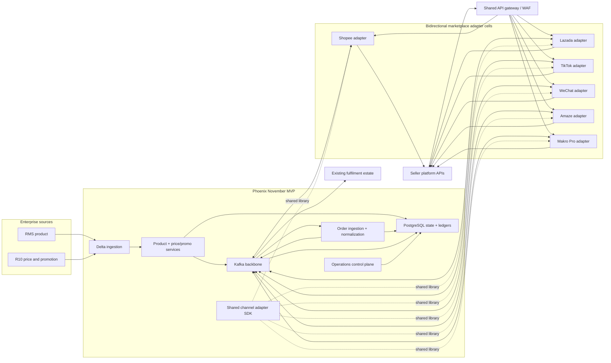
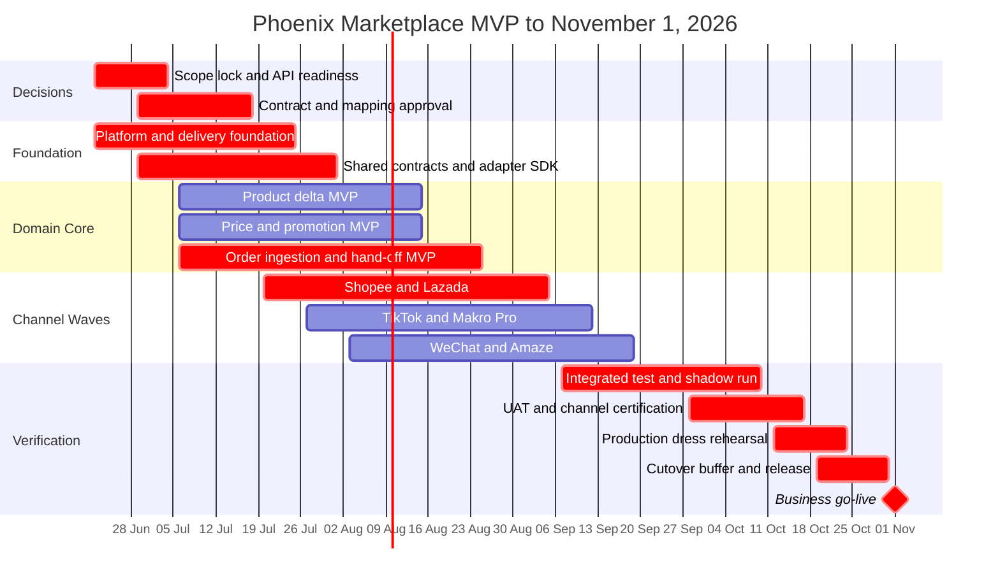

# Phoenix Multi-Channel Marketplace - November 1, 2026 Go-Live Proposal

Date: 2026-06-22  
Target go-live: 2026-11-01  
Architecture baseline: `phoenix-target-architecture-250-ops.md`  
Prior roadmap baseline: `phoenix-multi-channel-marketplace-proposal.md`
Comprehensive product requirements: [`phoenix-multi-channel-marketplace-prd.md`](phoenix-multi-channel-marketplace-prd.md)

## 1. Executive Recommendation

Retire the former August quick-win milestone and organize delivery around one controlled marketplace MVP go-live on November 1, 2026.

The target architecture remains valid and should not be simplified structurally. Kafka, PostgreSQL, Redis-compatible interfaces, Go services, channel-isolated delivery cells, object storage, Kubernetes, and operational telemetry remain the right boundaries. The milestone changes which capabilities are activated, not the architecture itself.

Recommended November scope:

- Product delta sync for existing, mapped marketplace listings and agreed essential attributes.
- Price and promotion delta sync, including Auto/Manual policy, clubpack rules, effective dates, retries, and reconciliation.
- Inbound order synchronization, canonical normalization, idempotency, persistence, and asynchronous hand-off to the existing fulfilment estate.
- Six marketplace channels: Shopee, Lazada, TikTok, WeChat, Amaze, and Makro Pro.
- Shared adapter SDK, Kafka command/result flows, PostgreSQL ledgers, operational dashboard, DLQ, replay, feature flags, and legacy fallback.

This is a breadth-first MVP. It deliberately excludes new-listing creation, category onboarding, media management, real-time ATS, stock allocation, mart channels, full order fulfilment, AWB generation, WMS replacement, BI, and advanced optimization.

The milestone is feasible only if platform credentials, current API specifications, test accounts, old .NET source, and business mapping rules are available early. Shopee, Lazada, and TikTok form the first certification wave. WeChat, Amaze, and Makro Pro remain committed channels only when their readiness gates are passed by the dates in this proposal.

## 2. Decision Context

### 2.1 What changed

The prior proposal optimized for an August price/promotion pilot followed by separate stock, catalog, and order phases. The sponsor now requests a November 1 production milestone covering product, price, promotion, and order synchronization across all six marketplace channels.

This introduces two material changes:

1. Channel breadth and business capability breadth must be delivered concurrently.
2. The first release must be an operable production slice rather than a single-domain technical pilot.

### 2.2 What did not change

The architecture capacity contract remains:

- 50,000 orders/day forecast.
- 250 accepted orders/second for no more than two minutes.
- 500 orders/second for two minutes as test headroom.
- 200,000 product catalog.
- Marketplace APIs remain the limiting factor for outbound completion.
- Until certified otherwise, each seller quota scope is limited to 100 requests/minute; normal scheduling uses 80 and reserves 20 for retries and urgent commands.
- Bulk APIs may accept up to 100 items/request, but the effective batch size is not guaranteed and is configured per channel, account, endpoint, and operation.
- PostgreSQL native partitioning is sufficient; application-level sharding is not required.
- Kafka provides durable acceptance, replay, backpressure, and channel isolation.
- Phoenix does not replace WMS operations.

No major architecture redesign is required for the new milestone. The principal work is delivery sequencing, scope control, adapter reuse, and certification.

## 3. Planning Assumptions

### 3.1 Team model

This proposal assumes:

- Four existing software engineers are available from June 22.
- Two additional software engineers join on July 22, bringing the engineering team to six.
- One dedicated QA engineer continues from the previous squad model.
- One Squad Lead / Tech Lead continues to own system design, technical decisions, delivery leadership, reviews, stakeholder alignment, and people management.
- Product owner, enterprise integration owners, security, infrastructure, WMS/fulfilment owners, and marketplace contacts are available as dependencies but are not counted as delivery capacity.

If "team of six" instead means six current engineers plus two joining later, this plan gains useful contingency; the committed scope should not be increased until channel certification risk is retired.

### 3.2 Capacity

From June 22 through October 30 there are approximately 95 weekdays before the Sunday, November 1 business go-live:

| Capacity item | Calculation | Nominal |
|---|---:|---:|
| Existing engineers before new joiners | 4 x 22 days | 88 MD |
| Six engineers after July 22 | 6 x 73 days | 438 MD |
| Engineering total |  | 526 MD |
| QA | 1 x 95 days | 95 MD |
| Squad Lead / Tech Lead | 1 x 95 days | 95 MD |

Practical planning capacity accounts for ceremonies, production support, onboarding, environment delays, design reviews, training, leave, and release hardening:

| Role | Practical capacity |
|---|---:|
| Software engineering | 380-395 MD |
| QA | 65-70 MD |
| Squad Lead / Tech Lead | 65-72 MD |
| **Total practical capacity** | **510-537 MD** |

The recommended scope is estimated at 490 MD, leaving only 20-47 MD of practical contingency. Scope discipline is therefore a release requirement.

### 3.3 External dependency assumptions

- Current production API contracts, quota scope, and batch limits are confirmed for all six channels by July 3. The planning fallback is 100 requests/minute with an unguaranteed maximum of 100 items/request.
- Sandbox or test accounts and credentials are available by July 10.
- Old .NET adapter source and relevant production configuration are readable by June 26.
- Representative RMS, R10/LDD, and order payloads are available by June 26.
- The existing fulfilment estate exposes a stable accepted-order hand-off contract by July 10.
- Business owners approve canonical product, price, promotion, and order mappings by July 17.
- Marketplace certification slots, where required, are booked no later than August 14.

Failure to meet these dates triggers the scope gates in Section 11 rather than compressing testing.

## 4. November 1 Product Definition

### 4.1 Product synchronization MVP

Included:

- Ingest RMS product snapshots or changes.
- Compute versioned product deltas.
- Resolve existing seller-SKU mappings.
- Validate required attributes and inactive status.
- Synchronize agreed essential attributes supported consistently by each channel.
- Batch dynamically within the certified per-operation maximum; correctness must not depend on a 100-item batch being available.
- Retry transient failures and route business failures to an operations queue.
- Reconcile Phoenix desired state against channel acknowledgements.

Excluded until after November:

- Creating a brand-new seller listing.
- Category discovery and category-specific attribute workflows.
- Image/video upload and media transformation.
- Product approval/moderation workflow.
- Bulk migration of unmapped SKUs.
- Complex bundle authoring beyond existing clubpack mappings.

This boundary is essential. Product update for mapped listings is achievable; complete seller-center product lifecycle parity across six heterogeneous platforms is not.

### 4.2 Price and promotion synchronization MVP

Included:

- R10/LDD ingestion.
- Effective regular-price and promotion calculation.
- Promotion start/end handling.
- Auto/Manual and override rules.
- Clubpack price calculation.
- Changed-entity detection and desired-state ledger.
- Campaign priority, deadline, retry, rate-limit handling, and reconciliation.
- Shared 80/20 request budget, dynamic batch sizing, and estimated quota-drain time.
- Channel acknowledgement and permanent-error classification.

Excluded until after November:

- Campaign creation inside seller platforms.
- Voucher, bundle-deal, add-on-deal, and advertising campaign management.
- AI price optimization.
- Automatic competitor-price matching.

### 4.3 Order synchronization MVP

Included:

- Bidirectional channel adapters receive webhooks where supported and perform overlap-safe polling otherwise; canonical normalization and idempotency run in order ingestion after Kafka.
- Signature/authentication verification and raw payload archival.
- Canonical order normalization.
- Duplicate suppression using channel/account/order/version keys.
- Order header, line, address, payment, and reference persistence.
- Basic completeness validation for mapping and required fields.
- Asynchronous accepted-order hand-off to the existing fulfilment estate.
- Retry, DLQ, operations exception, replay, and reconciliation.
- Cancellation ingestion before fulfilment acceptance when supported.

Excluded until after November:

- Redis ATS reservation and release.
- WMS routing optimization.
- Split fulfilment and package orchestration.
- AWB generation or printing.
- Picking, packing, pallet, and truck processes.
- Auto POS capture unless an existing reusable implementation requires minimal integration.
- Full outbound order-status state machine beyond the minimum acknowledgement required by each channel.

Legacy stock synchronization remains the production stock writer during this milestone. Phoenix order ingestion must not imply that oversell prevention has been solved.

### 4.4 Operational control plane

Included:

- Queue age, success rate, error class, retry, DLQ, and oldest-command views.
- Product/price/promotion desired-versus-acknowledged reconciliation.
- Order acceptance, duplicate, hand-off, and exception views.
- Channel/account kill switch.
- Feature flags by domain, channel, account, and SKU cohort.
- Explicit legacy/Phoenix writer ownership.
- Audit trail for retries, overrides, cutovers, and operator actions.

This is an operational dashboard, not BI or management reporting.

## 5. Architecture Application for the Milestone

Milestone-specific architecture decisions:

1. Keep separate bidirectional channel-adapter cells. Each cell owns webhook/poll ingress and outbound calls, while authentication, retry, telemetry, quota, payload-hash, and Kafka mechanics are shared through a Go adapter SDK. Canonical order normalization and idempotency remain in the order-ingestion service.
2. Implement product, price, and promotion as desired-state commands. Coalesce obsolete pending commands for the same channel/account/entity.
3. Enforce 100 requests/minute across all replicas in a quota scope with a distributed limiter; use 80 normally and reserve 20 for urgent work and retries.
4. Treat 100 items/request as an optimistic ceiling. Certify and configure effective batch size separately for every channel operation.
5. Never coalesce orders or order transitions.
6. Use the existing monthly OMS partition model for orders and harden its operational controls rather than redesigning it.
7. Keep Redis available for rate counters and disposable cache only in November. Production ATS activation remains a later phase.
8. Use object storage for source snapshots and raw marketplace payloads to support replay and audit without inflating PostgreSQL.
9. Preserve one explicit external writer per domain/channel during migration.

## 6. Delivery Options

### Option A - All Six Channels, Narrow Four-Domain MVP

Scope: The product definition in Section 4 for Shopee, Lazada, TikTok, WeChat, Amaze, and Makro Pro.

| Criterion | Assessment |
|---|---|
| Sponsor alignment | Highest |
| Business coverage | All requested channels and domains, with controlled depth |
| Delivery risk | High but manageable with hard gates |
| Estimated effort | 490 MD / 3,920 hours |
| November fit | Feasible with limited contingency |

Merit: Establishes Phoenix as the common marketplace control plane and meets the sponsor's breadth objective.

Trade-off: Product and order depth is intentionally limited. Any attempt to add new-listing workflows, ATS, or full fulfilment jeopardizes the date.

### Option B - Three Deep Channels, Three Shadow Channels

Scope: Shopee, Lazada, and TikTok production for the four MVP domains; WeChat, Amaze, and Makro Pro in shadow/dry-run. Use remaining capacity for fuller order status and product validation.

| Criterion | Assessment |
|---|---|
| Sponsor alignment | Medium |
| Business coverage | Highest-volume channels first |
| Delivery risk | Medium |
| Estimated effort | 440-460 MD |
| November fit | Strong |

Merit: Better production confidence and deeper functionality for the highest-value channels.

Trade-off: Does not satisfy an unconditional interpretation of all six channels live on November 1.

### Option C - Campaign Protection First

Scope: Product updates plus price/promotion for all six channels; order ingestion production for Shopee, Lazada, and TikTok; remaining order adapters shadow-only.

| Criterion | Assessment |
|---|---|
| Sponsor alignment | Medium-high |
| Business coverage | Directly protects double-date eligibility |
| Delivery risk | Lowest |
| Estimated effort | 410-430 MD |
| November fit | Strongest |

Merit: Maximizes confidence in campaign-critical outbound synchronization.

Trade-off: Incomplete order-channel migration.

### Recommendation

Choose Option A with Option B as the pre-approved fallback.

Option A provides the requested breadth without pretending to deliver full legacy parity. Option B must be activated automatically if any secondary channel misses its API-access, contract, or certification gate. The fallback is a governance decision made now, not a late project failure negotiated in October.

## 7. Recommended Effort Estimate

One manday equals eight manhours. Estimates include implementation, QA contribution, technical leadership, reviews, and production hardening. They exclude waiting time controlled by marketplace vendors or enterprise infrastructure approval.

| Workstream | Dev MD | QA MD | Lead MD | Total MD | Hours |
|---|---:|---:|---:|---:|---:|
| Discovery, .NET reverse engineering, API matrix | 16 | 2 | 10 | 28 | 224 |
| Platform foundation, CI/CD, Kafka, PostgreSQL, telemetry | 36 | 5 | 8 | 49 | 392 |
| Canonical contracts and shared Go adapter SDK | 28 | 4 | 6 | 38 | 304 |
| Product delta and mapped-listing sync MVP | 46 | 7 | 6 | 59 | 472 |
| Price and promotion delta sync MVP | 42 | 7 | 5 | 54 | 432 |
| Order ingestion, idempotency, persistence, hand-off | 50 | 9 | 7 | 66 | 528 |
| Shopee delivery cell | 20 | 4 | 3 | 27 | 216 |
| Lazada delivery cell | 18 | 3 | 3 | 24 | 192 |
| TikTok delivery cell | 20 | 4 | 3 | 27 | 216 |
| WeChat delivery cell | 17 | 3 | 2 | 22 | 176 |
| Amaze delivery cell | 17 | 3 | 2 | 22 | 176 |
| Makro Pro delivery cell | 17 | 3 | 2 | 22 | 176 |
| Operations dashboard and admin controls | 9 | 2 | 2 | 13 | 104 |
| Performance, resilience, and security verification | 10 | 5 | 3 | 18 | 144 |
| UAT, parallel run, cutover, and hypercare preparation | 10 | 7 | 4 | 21 | 168 |
| **Total** | **356** | **68** | **66** | **490** | **3,920** |

The estimate assumes 25-40% adapter effort reduction from the old .NET implementations. If an adapter has obsolete APIs, undocumented business rules, or no usable automated fixtures, its estimate must be re-baselined at the July 3 gate.

## 8. Schedule and Work Allocation

November 1, 2026 is a Sunday. Production cutover should complete by Friday, October 30, with November 1 treated as the business go-live and monitored hypercare window.

### 8.1 Delivery stages

| Stage | Dates | Exit outcome |
|---|---|---|
| Mobilize and lock scope | Jun 22-Jul 3 | API matrix, source audit, MVP definitions, dependency owners, fallback approved |
| Foundation and contracts | Jun 22-Jul 24 | Environments, Kafka, schemas, telemetry, CI/CD, canonical contracts, adapter SDK |
| Domain core implementation | Jul 6-Aug 21 | Product, price/promo, and order core usable through simulators |
| Channel Wave 1 | Jul 20-Sep 4 | Shopee and Lazada end-to-end |
| Channel Wave 2 | Jul 27-Sep 11 | TikTok and Makro Pro end-to-end |
| Channel Wave 3 | Aug 3-Sep 18 | WeChat and Amaze end-to-end |
| Integrated test and shadow | Sep 7-Oct 9 | Reconciliation, load, resilience, security, legacy comparison |
| UAT and certification | Sep 28-Oct 16 | Business sign-off and required marketplace approval |
| Dress rehearsal and release | Oct 12-Oct 30 | Cutover rehearsal, rollback proof, production release |
| Hypercare | Nov 1-Nov 13 | Elevated monitoring, daily reconciliation, rapid defect response |

### 8.2 New engineer onboarding

The two engineers joining around July 22 should not immediately own critical architecture. Their planned path is:

- Week 1: domain walkthrough, Go/Kafka conventions, local environment, contract-test fixtures.
- Week 2: pair on shared adapter SDK and one Wave 1 adapter defect/feature.
- Week 3 onward: primary ownership of WeChat/Amaze or Makro Pro delivery cells with senior review.

This converts onboarding into useful channel capacity without placing the order or pricing core on the critical path.

## 9. Channel Delivery Matrix

| Capability | Shopee | Lazada | TikTok | WeChat | Amaze | Makro Pro |
|---|---|---|---|---|---|---|
| Existing mapped product updates | Commit | Commit | Commit | Conditional commit | Conditional commit | Conditional commit |
| Price delta | Commit | Commit | Commit | Conditional commit | Conditional commit | Conditional commit |
| Promotion delta | Commit | Commit | Commit | Conditional commit | Conditional commit | Conditional commit |
| Order ingestion | Commit | Commit | Commit | Conditional commit | Conditional commit | Conditional commit |
| Idempotent fulfilment hand-off | Commit | Commit | Commit | Conditional commit | Conditional commit | Conditional commit |
| New listing creation | Later | Later | Later | Later | Later | Later |
| Production ATS reservation | Later | Later | Later | Later | Later | Later |
| Full status/AWB workflow | Later | Later | Later | Later | Later | Later |

"Conditional commit" becomes "Commit" when the channel passes all readiness gates. It becomes shadow/dry-run scope under Option B if a gate is missed.

## 10. Acceptance Criteria

### 10.1 Cross-cutting

- Every accepted command or order has a stable event ID, correlation ID, idempotency key, and auditable outcome.
- Duplicate delivery produces one business outcome.
- No production write can be owned simultaneously by Phoenix and the legacy platform for the same domain/channel/cohort.
- Retryable, business, permanent, and poison failures are classified separately.
- Channel outage does not stop other channels.
- Kill switches, replay, and rollback are demonstrated in the production dress rehearsal.
- Operational dashboards and alerts identify queue age, source delay, Phoenix processing, platform wait, and permanent failure separately.

### 10.2 Product

- At least 99.5% of valid mapped product deltas reach an acknowledged or terminal classified state.
- Inactive and unmapped products never produce unsafe channel writes.
- Replaying a product snapshot does not resend unchanged desired state.
- Desired-versus-channel reconciliation is available by channel and SKU.

### 10.3 Price and promotion

- Changed SKU p95 reaches seller acceptance within five minutes only when the changed set fits the certified quota/batch envelope; otherwise forecast completion and risk are visible before release.
- All adapter replicas combined remain within 100 requests/minute under normal processing, retry storms, restart, and consumer rebalance.
- Batch sizes 1, 20, 50, and 100 are tested; adapters fall back safely when a platform accepts less than its advertised maximum.
- Campaign backlog is empty or explicitly waived before the agreed midnight deadline.
- Auto/Manual, clubpack, promotion dates, and override fixtures pass for every channel.
- Suspicious or invalid prices are quarantined rather than sent.

### 10.4 Orders

- Ingress durably accepts 250 orders/second for two minutes and passes a 500 orders/second two-minute headroom test.
- p99 edge-to-Kafka acceptance is at or below 250 ms under the design peak.
- Internal order visibility p99 is at or below three seconds.
- Valid orders reach the external fulfilment hand-off within the agreed p95 target.
- Duplicate, out-of-order, cancellation, missing-mapping, and fulfilment-outage cases pass automated tests.
- No acknowledged order is lost during a pod, broker, or availability-zone failure test.

### 10.5 Release

- At least ten business days of shadow comparison are complete for Wave 1 and five for each later wave.
- No unresolved Severity 1 or Severity 2 defect remains.
- Required marketplace certifications and business UAT are signed off.
- Cutover and rollback rehearsals complete successfully.
- On-call ownership, dashboards, runbooks, and hypercare schedule are approved.

## 11. Gates and Scope Protection

| Gate | Due | Pass condition | Failure response |
|---|---|---|---|
| Adapter source audit | Jun 26 | Relevant .NET source and behavior can be traced | Re-estimate affected adapter; remove assumed reuse saving |
| API readiness | Jul 3 | Current docs, quota scope, certified batch limit per operation, auth flow, and contacts known | Channel moves to Option B shadow scope |
| Test access | Jul 10 | Working credentials and sandbox/test account | Channel moves to Option B shadow scope |
| Mapping approval | Jul 17 | Product, price, promo, and order mappings signed off | Freeze unsupported fields; no speculative implementation |
| Fulfilment contract | Jul 10 | Versioned accepted-order contract and test endpoint | Order go-live blocked independently of outbound sync |
| End-to-end adapter alpha | Sep 4/11/18 | Wave-specific happy path and retry path pass | Do not advance that channel to UAT |
| Certification complete | Oct 16 | Marketplace and business approvals obtained | Keep channel shadow-only |
| Dress rehearsal | Oct 23 | Cutover, rollback, replay, and reconciliation pass | No November production ownership transfer |

Scope additions after July 3 require an equal or larger removal. The protected exclusions are ATS, stock sync, new-listing creation, WMS workflow, full order status, mart channels, and fancy features.

## 12. Principal Risks

| Risk | Consequence | Mitigation |
|---|---|---|
| Six channel APIs differ more than old code suggests | Adapter work exceeds capacity | Audit first; shared SDK only for mechanics; activate Option B by gate |
| Product sync is interpreted as full listing creation | November scope becomes infeasible | Obtain written product MVP definition by July 3 |
| New engineers take longer to become productive | Wave 3 slips | Pair on adapters; keep domain core with existing team; protect contingency |
| QA becomes the bottleneck | Late integration defects | Contract simulators and reconciliation automation begin in July |
| Marketplace credentials or certification arrive late | A channel cannot go live | Date-based conditional commits and shadow fallback |
| R10/RMS source data is late or unstable | Phoenix misses end-to-end SLA | Measure source delay separately; archive source payload and reconcile |
| 100 requests/minute or smaller-than-expected bulk sizes cannot clear campaign changes | Midnight SLA missed | 80/20 quota budget, delta-only commands, dynamic batching, drain-time forecast, campaign priority, pre-stage, and quota negotiation |
| Order migration while legacy owns stock creates inconsistent expectations | Overselling remains | Declare stock out of scope; preserve legacy stock writer and reconcile order effects |
| Parallel writers create duplicate updates | Incorrect external state | Cohort-level writer lock and kill switch; no dual ownership |
| November 1 cutover occurs on a weekend | Reduced support availability | Complete technical cutover October 30 and staff explicit weekend hypercare |

## 13. Roadmap After November

### Phase 2 - Stock Correctness and Full Order Lifecycle

Target: November 2026-February 2027  
Indicative effort: 700-820 MD

- Stock Service stock delta ingestion and durable stock ledger.
- Redis ATS, atomic Lua updates, reservation, release, expiry, and replay.
- Safety stock and percentage allocation baseline.
- Marketplace stock adapters for all six channels.
- Full order status state machines.
- Cancellation compensation and reservation release.
- Capture sale and external status mapping where Phoenix retains ownership.
- Oversell root-cause explorer.

### Phase 3 - Full Catalog and Marketplace Capability

Target: Q1-Q2 2027  
Indicative effort: 360-460 MD

- New seller listing creation.
- Category and attribute mapping workflows.
- Image and media synchronization.
- Advanced bundles, variants, and approval states.
- Seller-center product pull and drift repair.
- Full product reconciliation and certification suites.

### Phase 4 - Dynamic Allocation and Mart Scale

Target: Q2-Q3 2027  
Indicative effort: 700-900 MD

- Sales-velocity allocation engine.
- Store-SKU partitioning and fan-out.
- Shopee Mart, LINE MAN Mart, Grab Mart, and Hato Mart.
- 2,000-store x 10,000-SKU load simulation.
- Store-level quota scheduling and exception workflows.

### Phase 5 - Operational Intelligence and Fancy Features

Target: Q3-Q4 2027  
Indicative effort: 220-320 MD

- Campaign Command Center with readiness risk score.
- SLA Autopilot that protects campaign and paid-order traffic.
- Predictive stock allocation using demand, margin, and campaign signals.
- Digital Twin Sync Simulator for large campaign rehearsal.
- Smart Promotion Guardrails for suspicious prices and invalid eligibility.
- Adapter Certification Lab with captured fixtures and sandbox automation.
- AI Operations Assistant for incident summaries and remediation suggestions.
- Self-healing replay recommendations with human approval.

### Phase 6 - Scoped Legacy Decommission

Target: after stable capability-by-capability ownership transfer  
Indicative effort: 200-240 MD

- Historical retention and archive.
- Final reconciliation and cutover by domain/channel.
- Retirement of replaced SQL Server jobs and .NET adapters.
- DR rehearsal, security cleanup, and operations handover.

## 14. Immediate Actions

1. Secure sponsor approval for the narrow definitions of product and order sync by June 26.
2. Confirm whether the staffing model is four current engineers plus two joining July 22, with QA and Tech Lead separate.
3. Run a five-day .NET adapter and API readiness audit for all six channels.
4. Name one business owner and one technical dependency owner for RMS, R10, fulfilment, and each channel.
5. Lock the canonical contracts and test fixtures before channel implementations diverge.
6. Approve Option B now as the automatic fallback for any secondary channel that misses a readiness gate.
7. Book marketplace certification and UAT windows immediately.
8. Establish a weekly milestone burn-up measured by accepted capabilities, not code completion.

## 15. Final Position

A November 1 go-live is credible for six marketplace channels only as a carefully bounded MVP. The architecture is ready for this plan; capacity is tight but workable. The decisive success factors are early API access, aggressive reuse of the behavioral knowledge in the .NET adapters, a shared adapter SDK, automated contract/reconciliation testing, and refusal to pull ATS, stock, complete WMS fulfilment, or full listing creation into the milestone.

The recommended contract with the sponsor is:

> By November 1, Phoenix will synchronize updates for existing mapped products, prices, promotions, and inbound orders across six marketplace channels, with production-grade idempotency, auditability, retries, reconciliation, operational controls, and legacy rollback. Deeper catalog, stock, allocation, and fulfilment capabilities will follow in explicitly funded phases.
